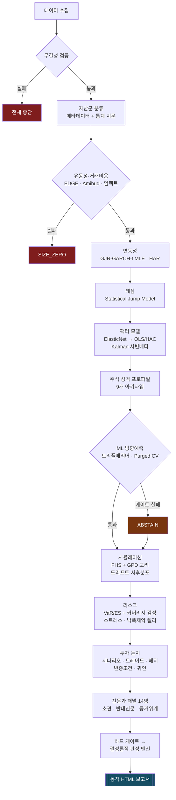

<div align="center">

<br>

<!--
  마크는 흰 잉크에 알파로만 형태를 만든다. GitHub 라이트 테마(흰 배경)
  에서는 통째로 사라진다. <picture> 로 배경에 맞는 잉크를 고른다 —
  GitHub 은 README 에서 prefers-color-scheme 미디어 쿼리를 지원한다.
-->
<picture>
  <source media="(prefers-color-scheme: dark)" srcset="webapp/static/plutus_mark.png">
  <source media="(prefers-color-scheme: light)" srcset="webapp/static/plutus_mark_light.png">
  
</picture>

<br><br>

# PLUTUS

**RESEARCH &nbsp;&amp;&nbsp; ANALYTICS**

<br>

**한국어** &nbsp;·&nbsp; [English](docs/README.en.md) &nbsp;·&nbsp; [日本語](docs/README.ja.md) &nbsp;·&nbsp; [简体中文](docs/README.zh-CN.md)

<br>

### 기관급 퀀트 분석 터미널

종목 하나를 넣으면 데이터 무결성부터 유동성·변동성·레짐·팩터·리스크까지 훑고,<br>
전문가 패널 14인의 심의를 거쳐 **외부 리소스 0개의 자기완결 HTML 보고서**를 만든다.

<br>


<br>

`Flask` · `pywebview` · `PyInstaller` · `Cloudflare Workers + D1`<br>
`numpy` · `pandas` · `scipy` · `scikit-learn`

**Tenko jun · 정준화**

<br>

</div>

---

<div align="center">

### 이름에 대하여

> **Plutus** (Πλοῦτος) — 그리스 신화의 부(富)의 신.
> 눈이 멀어 부를 **공정하게** 나눈다고 전해진다.
>
> 이 엔진도 같은 원칙을 따른다 — 보고 싶은 결론이 아니라
> **데이터가 허락하는 결론만** 낸다.

</div>

---

## 무엇이 다른가

|  |  |
|:--|:--|
| **기권하는 엔진** | 검정을 통과 못 한 모듈은 점수를 깎지 않고 **출력을 없앤다.** OOS 정확도 50%는 약한 신호가 아니라 신호 없음이다 |
| **3축 분리 판정** | 방향 · 리스크 예산 · 모델 신뢰도를 **하나로 합치지 않는다.** 성질이 다른 정보를 한 숫자로 뭉개면 정보가 파괴된다 |
| **단 / 중 / 장 다지평** | 63일 · 252일 · 1260일을 **평균하지 않고** 어긋나는 지점을 드러낸다 |
| **자산군 맞춤 렌즈** | 금과 소프트웨어를 같은 팩터로 보지 않는다. 자산군 19종 × 아키타입 9종 |
| **거시 대시보드** | 종목별로 **유의한 거시 변수만** 남긴다. `\|t\| < 2` 면 중립 |
| **당일 수급 스캐너** | 어제 **같은 시각** 대비 자금 이동 · 집중 매수/매도 · 섹터 강약 |
| **자기완결 보고서** | 섹션 37종 · 인라인 SVG 21종 · 테마 4종 · **외부 요청 0** |
| **용어 툴팁 66개** | 정의가 아니라 **왜 보는지 + 어떤 값이면 문제인지** |
| **무키 완전 동작** | API 키 없이 전 기능 동작. 키는 "있으면 좋아지는 보강재" |

---

## 30초 시작

```bash
git clone https://github.com/tenkojun/plutus.git
cd plutus
pip install -r requirements.txt
python run_desktop.py          # → http://127.0.0.1:8765
```

EXE 빌드:

```bash
python tools/release.py --build    # → dist/Plutus/ (194MB) + 릴리스 발행
```

개발·테스트:

```bash
pip install -r requirements-dev.txt
python -m pytest tests/ -q          # 추정량 검증 · 접근제어 · UI · 회귀
python tools/check_ui.py            # 인라인 JS 구문 (11,000줄 단일 HTML)
python tools/check_requirements.py  # 의존성 목록이 코드와 맞는가
```

`main` 푸시와 PR 마다 CI 가 같은 것을 돌린다. **네트워크를 타지 않으므로**
시세 API 가 죽어도 초록이다.

---

## 회원 등급

| | 무료 | 프리미엄 | 플래티넘 |
|:--|:--:|:--:|:--:|
| 보고서 생성 | **3회/일** | 무제한 | 무제한 |
| 정밀 분석 · 수급 스캐너 | ● | ● | ● |
| 보고서 테마 · 보관함 · 다운로드 | — | ● | ● |
| 에이전트 채팅 | — | ● | ● |
| 외부 접근 (터널) | — | — | ● |
| 분석 큐 우선순위 | — | — | ● |

한도와 기능 판정은 **전부 서버에서** 한다. 프론트에서만 막으면 라우트를
직접 호출하면 그만이다. 확인과 증가를 한 트랜잭션에서 처리해 동시 클릭으로
한도를 넘길 수 없다.


---

## 라이선스 — MIT

부팅 화면의 효과음은 전부 Web Audio 실시간 합성이라 오디오 파일이
0개이고, 부팅 로그와 줄별 지연 타이밍도 이 프로젝트가 직접 작성했다.

화면에서 쓰는 자바스크립트 라이브러리 **둘**은 제3자 저작물이다 —
TradingView Lightweight Charts(Apache-2.0)와 qrcode-generator(MIT).
둘 다 재배포를 허용하며, 출처와 라이선스는 [THIRD-PARTY.md](THIRD-PARTY.md)
에 있다. 전에는 CDN 에서 실행 시점에 받아 왔는데, 그러면 CDN 이 오염될 때
임의의 JS 가 이 앱의 출처로 실행되고 인터넷이 없으면 차트가 안 뜬다.
그래서 `webapp/static/vendor/` 로 들여왔다(합쳐서 182KB).

**분석 보고서에는 제3자 저작물이 하나도 없다.** 차트는 인라인 SVG 를
문자열로 만들고 시스템 폰트만 쓴다 — 인터넷 없이 열려야 하고, 몇 년 뒤에
열어도 그때 모습 그대로여야 하기 때문이다.

두 라이선스 모두 관대해서 소스 공개 의무 없이 EXE 단독 배포·상용 이용이
가능하다.

---

> ### 설계 원칙 하나
> **정밀함은 지표를 더 넣는 것이 아니라, 틀린 출력을 내지 않는 능력이다.**

대부분의 분석 도구는 근거가 없을 때도 "약한 매수 · 55점" 같은 숫자를 낸다.
그건 정보가 아니라 소음이고, 소음에 점수를 붙이면 사기가 된다.

이 엔진은 **검정을 통과하지 못한 모듈의 출력을 무효화(abstain)한다.**
OOS 정확도 50%는 약한 신호가 아니라 **신호 없음**이고,
그때 올바른 출력은 감점된 점수가 아니라 **출력 없음**이다.

```
G4  ML 과적합·보정   실패 → DISABLE_MODULE
    Murphy resolution 0.00000 ≈ 0  → 기저율 이상의 정보 없음
    Brier skill −0.007 ≤ 0         → 상수 예측만도 못함
    과적합 갭 49.6% > 15%          → in-sample 96.8% vs OOS 47.2%
    PBO 97.2% ≥ 75%               → 선택 절차가 구조적으로 과적합
    전략 DSR 0.0% < 90%            → 다중검정 보정 후 유의성 부족
```

이 경우 방향 확률은 **출력되지 않는다.** 낮은 점수가 아니라, 아무 값도 나오지 않는다.

---

## 파이프라인



판정은 LLM이 쓰지 않는다. 각 전문가의 결정 규칙에서 도출되므로
**같은 입력이면 같은 소견이 나온다 — 감사 가능하다.**

---

## 종목 성격에 따라 다른 렌즈로 본다

금과 구글을 같은 팩터로 보면 안 된다. 자산군마다 **팩터 prior · 스트레스 축 ·
기대 R² 밴드 · 연율화 기준 · 비중 상한**이 전부 다르다.

실제 실행 결과 (측정값):

| 종목 | 자산군 | 아키타입 | 선택된 팩터 | R² | 스트레스 | 사이즈 | 구속 제약 |
|---|---|---|---|---|---|---|---|
| **AAPL** | 대형 개별주 | 우량 복리성장주 | mkt·smb·hml·umd·vix·hy | 47.9% | −30.2% | 5.0% | 낙폭제약 켈리 |
| **GLD** | 귀금속 | — | **실질금리 · 달러** | 19.5% | −16.2% | 15.0% | 자산군 상한 |
| **TLT** | 국채 ETF | — | **명목10년 · 커브 · BEI** | **85.3%** | −30.7% | 15.0% | 낙폭제약 켈리 |
| **PFE** | 대형 개별주 | 배당 인컴주 | mkt·hml·rmw·umd·vix·hy | 22.1% | −26.7% | 15.0% | 자산군 상한 |

R² 밴드도 자산군마다 다르다 — 귀금속 10~55%, 국채 55~98%.
같은 밴드를 모든 자산에 들이대면 국채는 늘 "설명력 과다", 금은 늘 "붕괴"로 읽힌다.

**자산군 19종** · **주식 아키타입 9종** · **보고서 섹션 레지스트리 37개**

```
귀금속        실질금리 β는 반드시 시변. 금-TIPS R²는 2005–2021 약 84%에서
              2022년 이후 한 자릿수로 붕괴한 전례가 있음(한계 매수자 교체).
암호자산      연율화 √365. √252를 쓰면 변동성이 약 17% 과소평가됨.
레버리지 ETP  일간 리밸런싱 → 경로의존. 몬테카를로는 기초자산에 돌리고
              레버리지 경로를 재구성해야 함.
국채 ETF      DV01·KRD를 델타 패널에 반드시 포함.
```

주식은 여기서 한 겹 더 들어간다. **아키타입**에 따라 보고서 섹션 구성 자체가 바뀐다.

| 아키타입 | 활성화되는 섹션 |
|---|---|
| 우량 복리성장주 | 펀더멘털 · 어닝이벤트 · 스타일 · 고유위험 · 피어 |
| 고성장 적자기업 | 런웨이 · 희석 · 점프 프로파일 |
| 배당 인컴주 | 배당 지속성 · 금리 민감도 · 피어 |
| 이벤트 드리븐 | 점프·꼬리 섹션이 최상단, 평균 통계는 경고와 함께 강등 |

---

## 하드 게이트 — 실패는 감점이 아니라 무효화

| 게이트 | 항목 | 임계 | 실패 시 조치 |
|---|---|---|---|
| **G1** | 데이터 무결성 | 결측 > 2%, OHLC 위반, 중복일 | `HALT` — 전체 중단 |
| **G2** | 거래 가능성 | 스프레드 한도 초과, ADV < $1M, 무거래일 > 35% | `SIZE_ZERO` |
| **G3** | 팩터 모델 적합 | R²가 자산군 밴드의 35% 미만 | 알파 해석 차단 |
| **G4** | ML 과적합·보정 | PBO ≥ 50%, DSR < 90%, 과적합갭 > 15%, Resolution ≤ 1e-4, Brier skill ≤ 0 | `DISABLE_MODULE` |
| **G7** | 스트레스 한도 | 최악 손실 > 35% | `SIZE_ZERO` |
| **G8** | 분류 신뢰도 | 자산군 판정 불확실 | 최소 사이즈 |

게이트가 살아 있다는 건 **엔진이 자기 입력을 못 믿을 때 스스로 멈춘다**는 뜻이다.

---

## 사이징 — 켈리의 문제는 공식이 아니라 μ를 안다고 가정한 것

```
단순 켈리 μ/σ²        95%
  ↓ 추정오차·팻테일 반영
성장최적                5%   (그때 95% MDD 4%)
  ↓ 낙폭 제약
낙폭제약 켈리           5%   ← 최종 채택
```

성장 최적 켈리는 수학적으로 옳아도 **운용 불가능한 낙폭**을 동반한다.
낙폭 제약이 없으면 어떤 켈리 값도 실무 권고로 쓸 수 없다.

이 외에 변동성 타깃 · 스트레스 예산 · 유동성 한도 · 자산군 상한을 모두 계산하고
**가장 강하게 묶는 제약**을 최종 비중으로 채택한다. 무엇이 묶었는지 보고서에 명시된다.

---

## 보고서

한 종목당 **27~31개 섹션**, **약 235KB**, **외부 리소스 0개**의 자기완결 HTML.
차트는 전부 인라인 SVG — 인터넷 없이도 열린다.

```
I    판정        요약 · 3축 판정 · 종목 성격 · 단/중/장 지평 · 하드 게이트
II   투자 논지    드라이버 시나리오 · 트레이드 · 헤지 · 반증조건 · 수익귀인
                 거시경제 대시보드
III  전문가 심의  패널 14명 · 반대신문 · 레드팀
IV   종목 진단    스타일 · 피어 · 유동성 · 성과 · 변동성 · 레짐 · 팩터
                 델타패널 · 방향예측 · 분포시뮬 · 옵션 RND
V    리스크       VaR/ES · 스트레스 · 포지션 사이징
VI   운영·한계    촉매 캘린더 · 모니터링 플랜 · 말할 수 없는 것
```

섹션 레지스트리는 **37개**이고, 각 섹션은 스스로 `applies()` 를 판정한다.
옵션이 없는 종목엔 RND 섹션이 없고, 펀더멘털이 없는 ETF 엔 아키타입 섹션이
없다. **없는 데이터를 빈칸으로 채우지 않고, 섹션 자체를 내린다.**

**단일 점수를 내지 않는다.** 방향 / 리스크 예산 / 모델 신뢰도를 **3축으로 분리**한다.
성질이 다른 정보를 하나의 숫자로 합치면 정보가 파괴된다.

### 용어 툴팁

전문 용어 **66개**에 마우스를 올리면 설명이 뜬다.
정의만 쓰지 않고 **왜 보는지**와 **어떤 값이면 문제인지**까지 적었다.

> **DSR** — 디플레이티드 샤프 비율
> 여러 전략을 시도한 뒤 가장 좋은 걸 골랐다는 사실을 보정한 샤프.
> 100번 던져 나온 최고 기록은 실력이 아니다.
> 이 값이 90% 미만이면 다중검정 보정 후 유의성이 없다는 뜻.

### 단기 · 중기 · 장기 — 합치지 않는다

같은 종목도 보는 기간에 따라 결론이 달라진다. **그 자체가 정보다.**

| 지평 | 창 | 보는 것 |
|---|---|---|
| 단기 | 63영업일 | 누적수익 · 변동성 · 샤프 · MDD · SMA 기울기 · 상회비율 · MA 교차 |
| 중기 | 252영업일 | 위와 동일 + 지평별 시장 베타 |
| 장기 | 1260영업일 | 위와 동일 |

**종합 점수를 만들지 않는다.** 단기 55 · 중기 72 · 장기 74 를 기간가중해
67점(BUY)으로 뭉개면 "장기 구조적 상승 안의 중기 조정" 이라는 정보가 통째로
사라진다. 남는 건 어느 기간에도 해당하지 않는 평균 하나뿐이다.

대신 **어긋나는 지점을 찾아 드러낸다.**

- 추세 방향이 지평마다 갈리는가
- 샤프 **부호**가 뒤집히는가 (어느 하나만 인용하면 정반대 결론이 나온다)
- 시장 베타가 지평 간 0.5 이상 벌어지는가 → 구조 변화 신호
- 변동성 기간구조 — 단기/장기 비율. "보통" 같은 절대 라벨보다
  **자기 장기 수준 대비** 확대·축소가 정확하다

드리프트 μ̂ 는 표준오차 σ/√T 와 함께 낸다. 짧은 지평일수록 SE 가 커져
μ̂ 가 의미를 잃는데, **그 사실을 숨기지 않고 t값으로 표시한다.**

### 거시경제 대시보드 — 자산군마다 다른 변수

금과 구글을 같은 렌즈로 보면 안 된다. 실질금리는 금 가격의 핵심 동인이지만
소프트웨어 기업엔 할인율 경로일 뿐이고, HY 스프레드는 신용 민감 자산엔
결정적이지만 금엔 부차적이다.

거시 변수 **14종**(실질금리 · 10년물 · 곡선 기울기 · 브레이크이븐 ·
달러지수 · WTI · 구리/금 · HY OAS · VIX · 시장초과수익 등)을 놓고,
**해당 종목의 회귀 베타가 실제로 유의한 것만** 표에 남긴다.

- 영향 방향 = `sign(베타) × sign(3개월 변화)`
- `|t| < 2` 면 **중립** — 유의하지 않은 베타로 스토리를 만들지 않는다
- 로그수익률 변수(달러 · WTI · 유로 · 시장)와 수준 변수(금리 · 스프레드)를
  섞지 않는다. 단위를 틀리면 기여도가 +75% 로 튄다 — 실제로 겪고 고쳤다

### 시장 수급 스캐너

"지금 이 세션에서 돈이 어디로 몰리는가" 를 세 질문으로 나눠 답한다.

| 탭 | 답 |
|---|---|
| **자금 이동** | 어제 **같은 시각** 대비 거래대금 비중이 어디로 옮겨갔나 (%p) |
| **매수 / 매도** | 지금 어디를 집중적으로 사고 파는가 |
| **섹터 강약** | 오늘 어느 섹터가 강세인가 |

**미국에는 기관/외국인/개인 구분이 없다.** 공개된 실시간 주체별 매매동향이
존재하지 않는다 — 13F 는 분기별에 45일 지연이고, 세션 단위 주체 분해는
유료 틱 데이터 영역이다. 그래서 **주체가 아니라 행동**을 본다.

거래량은 통합(consolidated)이다. "무료 데이터는 IEX 라 2.5% 뿐"이라는 말은
**실시간 스트림**에만 해당한다 — 야후는 무키인데도 통합 거래량을 주고(실측
AAPL 일 4,000만 주대, IEX 단독이면 100만 주대), Alpaca 무료 등급도 `end` 가
15분 이전이면 SIP 바를 준다.

<details>
<summary><b>RVOL 은 반드시 같은 시각끼리 비교한다</b> — 왜 이게 함정인가</summary>

<br>

오전 10시의 누적거래량을 과거 **하루 전체** 평균과 비교하면 언제나 "거래량
부족" 이 나온다. 장 초반이니 당연하다.

```
RVOL = 오늘 09:30~현재 누적거래량
       ─────────────────────────────────
       과거 20일 09:30~같은시각 누적의 중앙값
```

평균이 아니라 중앙값을 쓴다. 실적발표일 하루가 평균을 끌어올려 그 뒤 한 달간
모든 종목을 '조용함' 으로 만드는 걸 막는다.

**합성 데이터 검증** — 진실값 3.0배를 심고 부분 세션에서 회수되는지 확인:

| 시점 | 봉 수 | 추정 RVOL |
|---|---|---|
| 개장 15분 | 3 / 78 | 2.66배 |
| 개장 50분 | 10 / 78 | 2.85배 |
| 반나절 | 39 / 78 | 2.92배 |
| 종일 | 78 / 78 | 2.99배 |

첫 구현은 여기서 **0.41배**가 나왔다. 피벗이 `fill_value=0` 후 `cumsum` 이라
오늘 행에도 마감 시각까지 값이 흘렀고, 거기서 '지금' 을 읽으니 기준이 하루
전체가 됐다. 막으려던 실수를 코드가 하고 있었다.

</details>

<details>
<summary><b>방향은 프록시다</b> — 거래량만으로는 매수/매도를 알 수 없다</summary>

<br>

RVOL 과 거래대금은 "얼마나 활발한가" 이지 "사는가 파는가" 가 아니다.
봉 데이터로 방향을 추정하는 표준 방법 둘을 함께 쓴다.

- **업/다운 볼륨** — 봉 수익률 부호로 거래량을 가른다
- **CMF** — `((종가−저가)−(고가−종가))/(고가−저가)` · 봉 안 종가 위치

둘이 어긋나면 숨기지 않고 **※불일치**로 표시한다.

CMF 는 봉 **안에서** 종가 위치만 보므로, 하루 종일 흘러내리면서도 매 봉
저가를 딛고 올라오면 순매수로 잡힌다. 실측에서 NVDA 가 −2.3% 인데 순매수
1위(+$1.4B)로 나왔다. 그대로 '집중 매수' 라고만 쓰면 오해를 부르므로
**"하락 중 저가 매수세 (봉 내 매수, 일간은 하락)"** 를 행 아래 적는다.

</details>

### 보고서 테마 · 앱 내 뷰어

보고서는 외부 리소스가 0개인 자기완결 HTML 이라 **생성 시점에 색이 굳는다.**
그래서 CSS 하드코딩 색(고유 39색 · 108회)을 기계적으로 변수로 치환하고
테마별 팔레트를 앞에 붙인다 — 다크 / 라이트 / 세피아 / 고대비.
다크 값은 원본 그대로라 기본 화면은 바뀌지 않는다.

보고서는 **앱 안 대형 팝업**에서 열린다(글자 크기 조절 · 다운로드 · 새 창).
**보관함**에서 지난 보고서를 종목·시각별로 다시 열고 내려받고 지울 수 있다.

---

## 실측 검증

엔진에 검증 스위트가 내장돼 있다. **합성 데이터에 진실값을 심고 회수되는지 확인한다.**

```bash
python -m engine.jiqtx.cli --validate
```

| 검증 항목 | 결과 |
|---|---|
| 스프레드 추정량 | EDGE만 편향 없이 복원 (진짜 5bp → 5.4bp). CS·Roll은 저스프레드에서 72bp·65bp로 심한 상향편향 |
| GJR-GARCH 파라미터 | α=0.050 γ=0.060 β=0.880 → 추정 0.067 / 0.087 / 0.844 |
| Murphy resolution | 정보성 0.08001 vs 무정보 0.00019 — **판별비 411배** |
| ACI conformal 커버리지 | 목표 90% → 실측 89.9% / 89.9% / 89.5% (정규 · t(3) · 레짐전환) |
| 낙폭제약 켈리 | SE(μ) 2%→25% 로 커질수록 90% → 60% 로 축소 |
| 아키타입 분류기 | 5/5 통과 |
| PEAD 검출력 | 주입 +16.0% → 추정 +16.57%, 귀무에서 거짓양성률 8% (명목 ≈7%) |

오프라인 데모로 전 파이프라인도 확인할 수 있다 (네트워크 불필요).

```bash
python -m engine.jiqtx.cli --demo
```

---

## 실행

```bash
pip install -r requirements.txt
python run_desktop.py
```

브라우저가 아니라 **앱 창**이 뜬다 (`pywebview`). 서버는 `127.0.0.1:8765`.
포트가 막혀 있으면 다음 빈 포트를 찾고, 이미 떠 있으면 창만 연다.

### EXE 빌드

```bash
python tools/release.py --build
```

`dist/Plutus/Plutus.exe` — **콘솔 창 없이 앱 창만** 열린다.
진단 로그는 화면이 아니라 `.data/logs/app.log` 로 간다.

같은 명령이 `dist/Plutus-Setup-x64.exe`(Inno Setup) 도 굽는다. 설치 위치는
Program Files 가 아니라 `%LOCALAPPDATA%\Programs\Plutus` 다 — Plutus 는 실행
파일 옆 `.data\` 에 쓰는데 Program Files 는 관리자만 쓸 수 있기 때문이다.
`PrivilegesRequired=lowest` 라 **UAC 가 아예 안 뜬다**(PC방·회사 PC 에서 중요).

코드 서명이 없어 SmartScreen 이 경고한다. `추가 정보` → `실행`.

바탕화면 바로가기(설치본은 설치 중에 물어본다):

```bash
powershell -ExecutionPolicy Bypass -File tools\make_shortcut.ps1
```

---

## API 키

**이 저장소에는 키가 들어 있지 않다.** 키 없이도 전부 동작한다 —
야후 파이낸스 + Stooq 무키 폴백이 기본이다.

키는 앱 실행 후 **설정 → API 키**에서 넣는다. 넣으면 데이터 품질이 오르는
보강재일 뿐, 없다고 기능이 잠기지 않는다.

| 제공자 | 쓰임 | 무료 한도 |
|---|---|---|
| Finnhub | 실시간 시세·뉴스·펀더멘털 | 분당 60콜 |
| Alpha Vantage | 기술지표·펀더멘털 | 분당 5 / 일 25콜 |
| FMP | 재무제표·SEC 공시 | 일 250콜 |

입력한 키는 `.data/keys.json` (권한 0600)에만 저장되고 `.gitignore` 대상이다.
환경변수(`FINNHUB_API_KEY` 등)를 쓰면 그쪽이 우선한다.

---

## 계정은 중앙에, 데이터는 여기에

로그인·가입·등급은 **Cloudflare Workers + D1** 위의 중앙 인증 서버가 처리한다.
전부 무료 티어 안에서 돈다. 앱에 기본 서버가 내장돼 있어 설치 직후 바로 로그인된다.

**내 PC 전원과 무관하게** 가입이 처리된다. 가입은 즉시 완료되고 무료 등급으로
시작한다 — 승인 대기를 두면 처음 온 사람이 아무것도 못 해 보고 떠난다.
한도는 등급이 막으므로 문을 잠글 이유가 없다.

이 PC에는 계정이 없다. 대신 **브라우저마다 별도 세션 쿠키**를 발급한다.
이 구분이 중요한 이유는 외부 접근 때문이다 — "이 PC에 로그인된 사람"을 곧
요청자로 삼으면 터널 주소를 아는 사람이 전부 주인 계정으로 들어온다.

| 질문 | 판단 주체 |
|---|---|
| **누구인가** (아이디·비밀번호·승인 여부) | 중앙 서버 |
| **이 브라우저가 로그인했는가** | 쿠키 |

보안 설계: PBKDF2-SHA256 10만 회(Workers 상한) · 상수시간 비교 ·
username/IP별 레이트리밋(30분 8회 → 15분 잠금) · 오픈 리다이렉트 차단 ·
계정 존재 여부가 응답 시간으로 새지 않도록 타이밍 보정.

자세한 배포·운영은 [`auth-worker/README.md`](auth-worker/README.md).

### 외부 접근

Cloudflare Tunnel로 집 밖에서 접속한다. 감시자가 터널을 지킨다.

- 20초마다 생사 확인, 죽으면 지수 백오프(5초→최대 5분)로 재시작
- 주소가 바뀌면 중앙 서버에 즉시 재등록 → **`/go/<아이디>` 고정 주소**가
  항상 살아 있는 터널을 가리킨다. 폰에는 이 주소 하나만 저장하면 된다
- 앱이 강제 종료돼도 다음 실행 때 유령 프로세스를 정리

---

## 상태는 전부 `.data/` 안에

프로그램 폴더 밖에 상태가 있으면 백업·이전·삭제가 반쪽이 된다.

```
.data/
├── keys.json               API 키 (0600)
├── auth.db                 분석 이력 · 커뮤니티 · 보유종목
├── browser_sessions.json   브라우저별 세션 ↔ 중앙 토큰
├── session.json            이 PC의 중앙 세션 (외부 접근 등록용)
├── jiqtx_ledger.db         예측 원장 (저장 → 채점 → 환류)
├── pc_id · chats/ · cache/ · bin/ · logs/
```

경로는 [`engine/paths.py`](engine/paths.py) 한 곳에서만 결정된다.
앱 폴더가 쓰기 불가면 `%LOCALAPPDATA%` 로 자동 강등한다.
`.data/` 전체가 `.gitignore` 대상이라 키가 저장소로 샐 일이 없다.

---

## 구조

```
.
├── version.py              앱 이름·버전·개발자·기본 인증서버 단일 소스
├── run_desktop.py          데스크톱 런처 (앱 창 · 포트 자동 · 중복 실행 방지)
├── app.spec                PyInstaller (console=False · 아이콘 · 버전리소스)
├── auth-worker/            중앙 인증 (Workers + D1)
├── webapp/
│   ├── server.py           Flask API — 125 라우트
│   └── static/index.html   단일 페이지 앱
└── engine/
    ├── paths.py            런타임 경로 단일 결정
    ├── jiqtx/              ★ 정밀 분석 엔진 — 33 모듈 / 15,601줄
    │   ├── config          자산군 19종 · 팩터 다리 · 게이트 임계
    │   ├── statcore        PSR/DSR · Purged CV · CPCV/PBO · Murphy · ACI
    │   ├── micro           EDGE · Amihud · 제곱근 임팩트 · capacity
    │   ├── vol regime      GJR-GARCH-t MLE · HAR · Jump Model
    │   ├── simulate        FHS + GPD 꼬리 + 드리프트 사후분포
    │   ├── taxonomy        3단계 자산 분류 (메타 + 통계 지문)
    │   ├── factors equity  팩터 라우터 · Kalman 시변베타 · 9 아키타입
    │   ├── ml              트리플배리어 → 모델 경합 → 기권 판정
    │   ├── options risk    RND · VaR/ES · 스트레스 · 낙폭제약 켈리
    │   ├── thesis trade    시나리오 · 반증조건 · 배리어확률 · 최소분산 헤지
    │   ├── agents panel    하드 게이트 · 전문가 14명 · 결정론적 판정
    │   ├── charts          외부 의존 없는 인라인 SVG 21종
    │   ├── glossary        용어 사전 66개 + 툴팁 엔진
    │   ├── horizons        단/중/장 지평별 독립 계산 + 불일치 탐지
    │   ├── macro_board     거시 14변수 × 유의 베타 필터
    │   ├── report_theme    테마 4종 팔레트 주입
    │   ├── dynamic_report  섹션 레지스트리 37개 · 자기완결 HTML
    │   ├── portfolio       위험기여 · 팩터 넷팅 · 배분 경합 (WF + Hansen MCS)
    │   └── ledger          예측 저장 → 채점 → 에이전트 가중치 환류
    ├── data/           다중소스 + market_flow (수급 스캐너)
    ├── auth/           세션 · prefs · quota (등급·일일한도)
    └── auth_remote/ cloud/ jobs/ portfolio/ awareness/ llm/
```

---

## 한계 — 읽고 쓸 것

이 목록은 겸손이 아니라 **사용 설명서**다.

| 한계 | 의미 |
|---|---|
| **생존편향** | 야후 파이낸스에 상장폐지 종목이 없다. 종목선택 전략은 **원리적으로 검증 불가**. |
| **일봉 한계** | 진짜 실현변동성·오더플로우는 인트라데이가 필요하다. |
| **펀더멘털 PIT 아님** | 리스테이트먼트 반영값이라 시계열 백테스트 금지. **현재 진단만.** |
| **옵션 스냅샷** | 히스토리가 없어 백테스트 불가. 오늘부터 축적해야 한다. |
| **체결 가정** | 종가가 아니라 다음 거래일 시가/VWAP를 가정해야 한다. **이 선택 하나가 수익성을 뒤집는다.** |
| **드리프트 표준오차** | σ/√T 라 일봉 표본에서 거의 항상 추정치만큼 크다. 상승확률은 시장이 아니라 **가정에 대한 진술**이다. |
| **스트레스** | 선형 델타 근사. 역사적 재현값도 손실 상한도 아니다. |

> **적중률은 크게 오르지 않는다.**
> 개선은 거짓신호 제거 · 리스크 추정 · 사이징 규율에서 나온다.

---

<div align="center">

이 소프트웨어는 방법론 연구·검증 목적이며 **투자 자문이 아니다.**

**Tenko jun (정준화)** · [CHANGELOG](CHANGELOG.md) · MIT License

</div>
