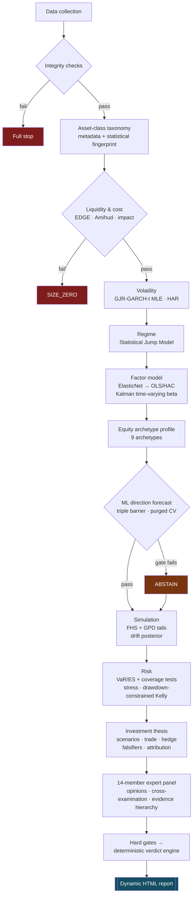

<div align="center">

<br>

<picture>
  <source media="(prefers-color-scheme: dark)" srcset="../webapp/static/plutus_mark.png">
  <source media="(prefers-color-scheme: light)" srcset="../webapp/static/plutus_mark_light.png">
  
</picture>

<br><br>

# PLUTUS

**RESEARCH &nbsp;&amp;&nbsp; ANALYTICS**

<br>

[한국어](../README.md) &nbsp;·&nbsp; **English** &nbsp;·&nbsp; [日本語](README.ja.md) &nbsp;·&nbsp; [简体中文](README.zh-CN.md)

<br>

### An institutional-grade quant research terminal

Give it one ticker. It walks from data integrity through liquidity, volatility, regime,<br>
factors and risk, puts the result past a 14-member expert panel, and writes a<br>
**self-contained HTML report with zero external resources.**

<br>

[](https://tenkojun.github.io/plutus/en/)


<br>

`Flask` · `pywebview` · `PyInstaller` · `Cloudflare Workers + D1`<br>
`numpy` · `pandas` · `scipy` · `scikit-learn`

<br>

**Tenko jun · Junhwa Jung**

<br>

</div>

---

<div align="center">

### About the name

> **Plutus** (Πλοῦτος) — the Greek god of wealth.
> Blind, so that he distributes wealth **impartially.**
>
> The engine follows the same principle: it reports not the conclusion
> you want, but **only the conclusion the data permits.**

</div>

---

## What is different

|  |  |
|:--|:--|
| **An engine that abstains** | A module that fails its test does not lose points — its **output is removed.** 50% out-of-sample accuracy is not a weak signal, it is no signal |
| **Three separate axes** | Direction, risk budget and model confidence are **never merged.** Collapsing different kinds of information into one number destroys it |
| **Short / mid / long horizons** | 63, 252 and 1260 days are **not averaged.** Where they disagree is what gets shown |
| **A lens per asset class** | Gold and software are not viewed through the same factors. 19 asset classes × 9 archetypes |
| **Macro dashboard** | Only the macro variables that are **actually significant for this ticker** survive. `\|t\| < 2` means neutral |
| **Intraday flow scanner** | Money migration vs. **the same clock time** yesterday, concentrated buying/selling, sector strength |
| **Self-contained report** | 37 section types · 21 inline SVG charts · 4 themes · **zero external requests** |
| **66 term tooltips** | Not definitions — **why you look at it, and what value is a problem** |
| **Fully working with no keys** | Every feature runs without an API key. Keys are reinforcement, not a gate |

---

## Start in 30 seconds

```bash
git clone https://github.com/tenkojun/plutus.git
cd plutus
pip install -r requirements.txt
python run_desktop.py          # → http://127.0.0.1:8765
```

Build the EXE:

```bash
python tools/release.py --build    # → dist/Plutus/ (194MB) + publishes the release
```

Development and tests:

```bash
pip install -r requirements-dev.txt
python -m pytest tests/ -q          # estimators · access control · UI · regressions
python tools/check_ui.py            # inline JS syntax (11,000-line single HTML)
python tools/check_requirements.py  # does the dependency list match the code
```

CI runs the same thing on every push to `main` and every PR. It **never touches the
network**, so it stays green even when a market data API is down.

---

## Membership tiers

| | Free | Premium | Platinum |
|:--|:--:|:--:|:--:|
| Report generation | **3 / day** | unlimited | unlimited |
| Full analysis · flow scanner | ● | ● | ● |
| Report themes · library · download | — | ● | ● |
| Agent chat | — | ● | ● |
| Remote access (tunnel) | — | — | ● |
| Analysis queue priority | — | — | ● |

Limits and feature checks are enforced **entirely on the server.** Blocking only in the
frontend means anyone can just call the route directly. The check and the increment
happen in one transaction, so simultaneous clicks cannot push you past the limit.

Signing up is instant — there is no approval queue. A new account starts on Free.

---

## License — MIT

Every sound in the boot screen is synthesised live with Web Audio, so there are zero
audio files, and the boot log text and its per-line timing were written for this project.

**Two** JavaScript libraries on screen are third-party work: TradingView Lightweight
Charts (Apache-2.0) and qrcode-generator (MIT). Both permit redistribution; sources and
licenses are in [THIRD-PARTY.md](../THIRD-PARTY.md). They used to be pulled from a CDN at
runtime, which means a poisoned CDN executes arbitrary JS under this app's origin — and no
internet means no charts. So they were vendored into `webapp/static/vendor/` (182KB total).

**The analysis reports contain no third-party work at all.** Charts are built as inline
SVG strings and only system fonts are used, because a report has to open without internet
and still look the way it did when you open it years later.

Both licenses are permissive: the EXE can be distributed standalone and used commercially
with no obligation to open the source.

---

> ### One design principle
> **Precision is not adding more indicators. It is the ability to not emit a wrong output.**

Most analysis tools will print "weak buy · 55 points" even when there is no basis for it.
That is not information, it is noise — and putting a score on noise is fraud.

This engine **invalidates (abstains) the output of any module that fails its test.**
50% out-of-sample accuracy is not a weak signal, it is **no signal**, and the correct
output then is not a reduced score but **no output.**

```
G4  ML overfit / calibration   FAIL → DISABLE_MODULE
    Murphy resolution 0.00000 ≈ 0  → no information beyond the base rate
    Brier skill −0.007 ≤ 0         → worse than a constant prediction
    Overfit gap 49.6% > 15%        → in-sample 96.8% vs OOS 47.2%
    PBO 97.2% ≥ 75%                → the selection procedure is structurally overfit
    Strategy DSR 0.0% < 90%        → not significant after multiple-testing adjustment
```

In that case the directional probability is **not printed.** Not a low score — no value at all.

---

## Pipeline



No LLM writes the verdict. It is derived from each expert's decision rules, so
**the same input yields the same opinion — it is auditable.**

---

## A different lens depending on what the ticker is

Gold and Google must not be viewed through the same factors. Every asset class has its own
**factor priors, stress axes, expected R² band, annualisation convention and weight cap.**

Actual run output (measured):

| Ticker | Asset class | Archetype | Selected factors | R² | Stress | Size | Binding constraint |
|---|---|---|---|---|---|---|---|
| **AAPL** | large-cap single name | quality compounder | mkt·smb·hml·umd·vix·hy | 47.9% | −30.2% | 5.0% | drawdown-constrained Kelly |
| **GLD** | precious metals | — | **real rates · dollar** | 19.5% | −16.2% | 15.0% | asset-class cap |
| **TLT** | treasury ETF | — | **nominal 10y · curve · BEI** | **85.3%** | −30.7% | 15.0% | drawdown-constrained Kelly |
| **PFE** | large-cap single name | dividend income | mkt·hml·rmw·umd·vix·hy | 22.1% | −26.7% | 15.0% | asset-class cap |

The R² band differs by asset class too — 10–55% for precious metals, 55–98% for treasuries.
Apply one band to everything and treasuries always read as "over-explained" and gold always
reads as "broken".

**19 asset classes** · **9 equity archetypes** · **37 report sections in the registry**

```
Precious metals  the real-rate beta must be time-varying. Gold–TIPS R² has gone from
                 ~84% (2005–2021) to single digits after 2022 (the marginal buyer changed).
Crypto           annualise with √365. Using √252 understates volatility by about 17%.
Leveraged ETPs   daily rebalancing → path dependence. Run Monte Carlo on the underlying
                 and reconstruct the levered path.
Treasury ETFs    DV01 and KRD must be in the delta panel.
```

Equities go one layer deeper. The **archetype** changes which sections the report has at all.

| Archetype | Sections it activates |
|---|---|
| Quality compounder | fundamentals · earnings events · style · idiosyncratic risk · peers |
| High-growth, unprofitable | runway · dilution · jump profile |
| Dividend income | dividend sustainability · rate sensitivity · peers |
| Event-driven | jump and tail sections move to the top; mean statistics are demoted with a warning |

---

## Hard gates — failure invalidates, it does not deduct

| Gate | Item | Threshold | Action on failure |
|---|---|---|---|
| **G1** | data integrity | missing > 2%, OHLC violations, duplicate dates | `HALT` — stop everything |
| **G2** | tradability | spread over cap, ADV < $1M, no-trade days > 35% | `SIZE_ZERO` |
| **G3** | factor model fit | R² below 35% of the asset-class band | alpha interpretation blocked |
| **G4** | ML overfit / calibration | PBO ≥ 50%, DSR < 90%, overfit gap > 15%, resolution ≤ 1e-4, Brier skill ≤ 0 | `DISABLE_MODULE` |
| **G7** | stress limit | worst-case loss > 35% | `SIZE_ZERO` |
| **G8** | classification confidence | asset-class call is uncertain | minimum size |

Live gates mean **the engine stops itself when it cannot trust its own input.**

---

## Sizing — Kelly's problem is not the formula, it is assuming you know μ

```
naive Kelly μ/σ²            95%
  ↓ estimation error and fat tails
growth optimal                5%   (95% MDD of 4% at that point)
  ↓ drawdown constraint
drawdown-constrained Kelly    5%   ← adopted
```

Growth-optimal Kelly is mathematically correct and comes with an **unoperatable drawdown.**
Without a drawdown constraint no Kelly number can be used as a practical recommendation.

Volatility target, stress budget, liquidity cap and asset-class cap are all computed as well,
and the **most binding constraint** becomes the final weight. The report states which one bound.

---

## The report

**27–31 sections** per ticker, **about 235KB**, a self-contained HTML with **zero external
resources.** Every chart is inline SVG — it opens without internet.

```
I    Verdict       summary · 3-axis verdict · ticker character · short/mid/long · hard gates
II   Thesis        driver scenarios · trade · hedge · falsifiers · return attribution
                   macro dashboard
III  Deliberation  14 experts · cross-examination · red team
IV   Diagnostics   style · peers · liquidity · performance · volatility · regime · factors
                   delta panel · direction forecast · distribution sim · option RND
V    Risk          VaR/ES · stress · position sizing
VI   Operations    catalyst calendar · monitoring plan · what cannot be said
```

The registry has **37 sections** and each one decides `applies()` for itself. A ticker with
no options has no RND section; an ETF with no fundamentals has no archetype section.
**Missing data is not filled with blanks — the section is dropped.**

**No single score is produced.** Direction, risk budget and model confidence stay on
**three separate axes.** Merging different kinds of information into one number destroys it.

### Term tooltips

Hovering any of **66 technical terms** shows an explanation. Not just a definition —
**why you look at it** and **what value constitutes a problem.**

> **DSR** — Deflated Sharpe Ratio
> The Sharpe ratio adjusted for the fact that you tried many strategies and kept the best.
> The best of 100 coin flips is not skill.
> Below 90% means it is not significant after multiple-testing adjustment.

### Short · mid · long — never merged

The same ticker gives different conclusions depending on the window. **That is itself information.**

| Horizon | Window | What it looks at |
|---|---|---|
| Short | 63 trading days | cumulative return · volatility · Sharpe · MDD · SMA slope · hit rate · MA cross |
| Mid | 252 trading days | the same, plus horizon-specific market beta |
| Long | 1260 trading days | the same |

**No composite score is built.** Weighting short 55 · mid 72 · long 74 into 67 (BUY)
erases the fact that this is "a mid-term correction inside a long-term structural uptrend".
What is left is one average that describes no horizon at all.

Instead, **the disagreements are found and shown.**

- Does the trend direction differ across horizons
- Does the **sign** of the Sharpe flip (quote one horizon and you get the opposite conclusion)
- Do market betas differ by more than 0.5 across horizons → a structural-change signal
- Volatility term structure — short/long ratio. Expansion or contraction **relative to the
  ticker's own long-run level** is more accurate than an absolute label like "normal"

Drift μ̂ is always reported with its standard error σ/√T. The shorter the horizon the larger
the SE and the less μ̂ means — and **that fact is not hidden, it is shown as a t-value.**

### Macro dashboard — different variables per asset class

Gold and Google must not share a lens. Real rates are the core driver of gold but only a
discount-rate path for a software company; HY spreads are decisive for credit-sensitive
assets and secondary for gold.

**14 macro variables** (real rates, 10-year, curve slope, breakevens, dollar index, WTI,
copper/gold, HY OAS, VIX, market excess return and others) are regressed, and **only those
whose beta is actually significant for this ticker** remain in the table.

- Direction of impact = `sign(beta) × sign(3-month change)`
- `|t| < 2` means **neutral** — no story is built on an insignificant beta
- Log-return variables (dollar, WTI, euro, market) are never mixed with level variables
  (rates, spreads). Get the units wrong and a contribution jumps to +75% — this actually
  happened and was fixed

### Market flow scanner

"Where is money going in this session" is answered as three separate questions.

| Tab | Answer |
|---|---|
| **Money migration** | where the share of traded value moved vs. **the same clock time** yesterday (%p) |
| **Buy / sell** | what is being bought and sold concentratedly right now |
| **Sector strength** | which sector is strong today |

**The US has no institutional/foreign/retail breakdown.** There is no public real-time
by-participant flow — 13F is quarterly with a 45-day lag, and session-level participant
decomposition lives in paid tick data. So this looks at **behaviour, not participants.**

Volume is consolidated. The claim that "free data is IEX, so only 2.5%" applies to
**real-time streams** only — Yahoo gives consolidated volume with no key (measured: AAPL
around 40M shares/day, versus around 1M if it were IEX alone), and Alpaca's free tier
serves SIP bars when `end` is more than 15 minutes ago.

<details>
<summary><b>RVOL must compare the same clock time</b> — why this is a trap</summary>

<br>

Compare 10am cumulative volume against the average of past **full days** and you always get
"low volume". Of course you do — the session just started.

```
RVOL = today's cumulative volume 09:30 → now
       ──────────────────────────────────────────────
       median of the past 20 days' 09:30 → same time
```

Median, not mean. One earnings day would otherwise lift the mean and mark every ticker
"quiet" for a month.

**Synthetic validation** — plant a ground truth of 3.0× and check recovery from a partial session:

| Point in session | Bars | Estimated RVOL |
|---|---|---|
| 15 min in | 3 / 78 | 2.66× |
| 50 min in | 10 / 78 | 2.85× |
| half day | 39 / 78 | 2.92× |
| full day | 78 / 78 | 2.99× |

The first implementation returned **0.41×** here. The pivot did `fill_value=0` then `cumsum`,
so today's row carried values all the way to the close, and reading "now" out of that made the
denominator a full day. The code was making the exact mistake it was written to prevent.

</details>

<details>
<summary><b>Direction is a proxy</b> — volume alone cannot tell buying from selling</summary>

<br>

RVOL and traded value say "how active", not "buying or selling". Two standard bar-based
direction estimators are used together.

- **Up/down volume** — split volume by the sign of the bar return
- **CMF** — `((close−low)−(high−close))/(high−low)` · where the close sits inside the bar

When they disagree it is not hidden — the row is marked **※mismatch**.

CMF only looks at the close's position **inside** the bar, so a name that bleeds all day but
lifts off the low of every bar registers as net buying. In a live run NVDA was −2.3% yet came
out #1 in net buying (+$1.4B). Writing only "concentrated buying" would mislead, so the row
carries **"dip buying (intrabar buying, down on the day)"** underneath.

</details>

### Report themes · in-app viewer

The report is a self-contained HTML with zero external resources, which means **its colours
are frozen at generation time.** So the hardcoded CSS colours (39 unique, 108 occurrences)
were mechanically replaced with variables and a per-theme palette is prepended — dark, light,
sepia, high-contrast. The dark values are the originals, so the default view is unchanged.

Reports open in a **large in-app popup** (font size control, download, new window). The
**library** lets you reopen, download and delete past reports by ticker and timestamp.

---

## Measured validation

A validation suite is built into the engine. **It plants a ground truth in synthetic data and
checks that the estimator recovers it.**

```bash
python -m engine.jiqtx.cli --validate
```

| Check | Result |
|---|---|
| Spread estimators | only EDGE recovers without bias (true 5bp → 5.4bp). CS and Roll are badly biased upward at 72bp and 65bp on low spreads |
| GJR-GARCH parameters | α=0.050 γ=0.060 β=0.880 → estimated 0.067 / 0.087 / 0.844 |
| Murphy resolution | informative 0.08001 vs uninformative 0.00019 — a **411× discrimination ratio** |
| ACI conformal coverage | target 90% → measured 89.9% / 89.9% / 89.5% (normal · t(3) · regime switching) |
| Drawdown-constrained Kelly | shrinks 90% → 60% as SE(μ) grows from 2% to 25% |
| Archetype classifier | 5/5 pass |
| PEAD power | injected +16.0% → estimated +16.57%, false positive rate 8% under the null (nominal ≈7%) |

The whole pipeline can also be run offline as a demo (no network needed).

```bash
python -m engine.jiqtx.cli --demo
```

---

## Running it

```bash
pip install -r requirements.txt
python run_desktop.py
```

An **app window** opens, not a browser (`pywebview`). The server is on `127.0.0.1:8765`.
If the port is taken it finds the next free one; if an instance is already up it just opens the window.

### Building the EXE

```bash
python tools/release.py --build
```

`dist/Plutus/Plutus.exe` — **an app window with no console.** Diagnostic logs go to
`.data/logs/app.log`, not the screen.

The same command also bakes `dist/Plutus-Setup-x64.exe` (Inno Setup). It installs to
`%LOCALAPPDATA%\Programs\Plutus`, not Program Files, because Plutus writes to `.data\` next
to the executable and Program Files is admin-only. `PrivilegesRequired=lowest` means
**no UAC prompt at all** — which matters on shared and corporate machines.

There is no code signing, so SmartScreen will warn: `More info` → `Run anyway`.

---

## API keys

**There are no keys in this repository.** Everything works without them — Yahoo Finance plus
Stooq is the keyless default.

Keys go in through **Settings → API keys** after launching the app. They improve data quality;
nothing is locked without them.

| Provider | Used for | Free limit |
|---|---|---|
| Finnhub | real-time quotes, news, fundamentals | 60 calls/min |
| Alpha Vantage | technical indicators, fundamentals | 5/min, 25/day |
| FMP | financial statements, SEC filings | 250/day |

Entered keys are stored only in `.data/keys.json` (mode 0600) and that path is gitignored.
Environment variables (`FINNHUB_API_KEY` and friends) take precedence if set.

---

## Accounts live centrally, data lives here

Login, signup and tiers are handled by a central auth server on **Cloudflare Workers + D1**,
entirely within the free tier. The default server is built into the app, so you can log in
immediately after installing.

Signup works **whether or not my PC is on**, completes instantly, and starts on the free tier —
an approval queue just means the first-time visitor leaves without seeing anything. The tier
already caps usage, so there is no reason to lock the door.

There are no accounts on this PC. Instead **each browser gets its own session cookie.** That
distinction matters because of remote access — if "whoever is logged in on this PC" is treated
as the requester, then everyone who knows the tunnel address arrives as the owner.

| Question | Decided by |
|---|---|
| **Who is this** (username, password, status) | central server |
| **Is this browser logged in** | cookie |

Security design: PBKDF2-SHA256 at 100,000 iterations (the Workers cap), constant-time
comparison, per-username and per-IP rate limiting (8 failures in 30 minutes → 15-minute lock),
open-redirect blocking, and timing compensation so account existence does not leak through
response time.

Deployment and operations details are in [`auth-worker/README.md`](../auth-worker/README.md).

### Remote access

Cloudflare Tunnel gets you in from outside the house. A watchdog guards the tunnel.

- Liveness check every 20 seconds; on death, exponential backoff restart (5s → 5 min max)
- If the address changes it re-registers with the central server immediately → the
  **fixed `/go/<username>` address** always points at a live tunnel. Your phone only ever
  stores that one URL
- If the app is killed, orphan processes are cleaned up on the next launch

---

## All state lives under `.data/`

State outside the program folder makes backup, migration and deletion half-complete.

```
.data/
├── keys.json               API keys (0600)
├── auth.db                 analysis history · community · holdings
├── browser_sessions.json   per-browser session ↔ central token
├── session.json            this PC's central session (for remote-access registration)
├── jiqtx_ledger.db         prediction ledger (store → score → feed back)
├── pc_id · chats/ · cache/ · bin/ · logs/
```

Paths are decided in exactly one place, [`engine/paths.py`](../engine/paths.py). If the app
folder is not writable it falls back to `%LOCALAPPDATA%`. `PLUTUS_DATA_DIR` moves it anywhere
you like. All of `.data/` is gitignored, so keys cannot leak into the repository.

---

## Structure

```
.
├── version.py              single source for name · version · author · default auth server
├── run_desktop.py          desktop launcher (app window · auto port · single instance)
├── app.spec                PyInstaller (console=False · icon · version resource)
├── auth-worker/            central auth (Workers + D1)
├── webapp/
│   ├── server.py           Flask API — 125 routes
│   └── static/index.html   single-page app
└── engine/
    ├── paths.py            single decision point for runtime paths
    ├── jiqtx/              ★ the analysis engine — 33 modules / 15,601 lines
    │   ├── config          19 asset classes · factor legs · gate thresholds
    │   ├── statcore        PSR/DSR · purged CV · CPCV/PBO · Murphy · ACI
    │   ├── micro           EDGE · Amihud · square-root impact · capacity
    │   ├── vol regime      GJR-GARCH-t MLE · HAR · Jump Model
    │   ├── simulate        FHS + GPD tails + drift posterior
    │   ├── taxonomy        3-stage asset classification (metadata + statistics)
    │   ├── factors equity  factor router · Kalman time-varying beta · 9 archetypes
    │   ├── ml              triple barrier → model bake-off → abstain decision
    │   ├── options risk    RND · VaR/ES · stress · drawdown-constrained Kelly
    │   ├── thesis trade    scenarios · falsifiers · barrier probabilities · min-variance hedge
    │   ├── agents panel    hard gates · 14 experts · deterministic verdict
    │   ├── charts          21 inline SVG chart types, no external dependency
    │   ├── glossary        66-term dictionary + tooltip engine
    │   ├── horizons        independent short/mid/long computation + disagreement detection
    │   ├── macro_board     14 macro variables × significant-beta filter
    │   ├── report_theme    4-theme palette injection
    │   ├── dynamic_report  37-section registry · self-contained HTML
    │   ├── portfolio       risk contribution · factor netting · allocation bake-off (WF + Hansen MCS)
    │   └── ledger          store predictions → score → feed back into agent weights
    ├── data/           multi-source + market_flow (flow scanner)
    ├── auth/           sessions · prefs · quota (tiers · daily limits)
    └── auth_remote/ cloud/ jobs/ portfolio/ awareness/ llm/
```

---

## Limitations — read these

This list is not modesty, it is **the manual.**

| Limitation | What it means |
|---|---|
| **Survivorship bias** | Yahoo Finance has no delisted tickers. Stock-selection strategies are **unverifiable in principle.** |
| **Daily bars** | True realised volatility and order flow need intraday data. |
| **Fundamentals are not point-in-time** | They reflect restatements, so no time-series backtesting. **Current diagnosis only.** |
| **Options are a snapshot** | No history, so no backtesting. You have to start accumulating today. |
| **Fill assumption** | You should assume next-session open or VWAP, not the close. **That one choice flips profitability.** |
| **Drift standard error** | It is σ/√T, so on daily samples it is almost always as large as the estimate itself. An up-probability is a statement about **assumptions**, not about the market. |
| **Stress** | A linear delta approximation. Neither a historical replay nor an upper bound on loss. |

> **Hit rate does not improve much.**
> The gains come from removing false signals, from risk estimation, and from sizing discipline.

---

<div align="center">

This software is for methodology research and validation. **It is not investment advice.**

**Tenko jun (Junhwa Jung)** · [CHANGELOG](../CHANGELOG.md) · MIT License

</div>
