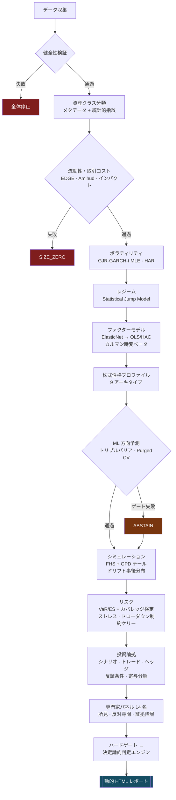

<div align="center">

<br>

<picture>
  <source media="(prefers-color-scheme: dark)" srcset="../webapp/static/plutus_mark.png">
  <source media="(prefers-color-scheme: light)" srcset="../webapp/static/plutus_mark_light.png">
  
</picture>

<br><br>

# PLUTUS

**RESEARCH &nbsp;&amp;&nbsp; ANALYTICS**

<br>

[한국어](../README.md) &nbsp;·&nbsp; [English](README.en.md) &nbsp;·&nbsp; **日本語** &nbsp;·&nbsp; [简体中文](README.zh-CN.md)

<br>

### 機関投資家水準のクオンツ分析ターミナル

銘柄を一つ入れると、データ健全性から流動性・ボラティリティ・レジーム・ファクター・リスクまでを通し、<br>
14 名の専門家パネルの審議を経て **外部リソース 0 個の自己完結 HTML レポート** を生成する。

<br>


<br>

`Flask` · `pywebview` · `PyInstaller` · `Cloudflare Workers + D1`<br>
`numpy` · `pandas` · `scipy` · `scikit-learn`

<br>

**Tenko jun · 鄭俊和 (Junhwa Jung)**

<br>

</div>

---

<div align="center">

### 名前について

> **Plutus**（Πλοῦτος）— ギリシャ神話の富の神。
> 目が見えないがゆえに、富を **公平に** 分け与えると伝えられる。
>
> このエンジンも同じ原則に従う。見たい結論ではなく、
> **データが許す結論だけ** を出す。

</div>

---

## 何が違うのか

|  |  |
|:--|:--|
| **棄権するエンジン** | 検定を通らなかったモジュールは減点ではなく **出力そのものを消す。** OOS 精度 50% は弱いシグナルではなく、シグナルがないということ |
| **3 軸分離の判定** | 方向・リスク予算・モデル信頼度を **一つにまとめない。** 性質の違う情報を一つの数字に潰すと情報が壊れる |
| **短期 / 中期 / 長期** | 63 日・252 日・1260 日を **平均せず**、食い違う点を可視化する |
| **資産クラス別のレンズ** | 金とソフトウェアを同じファクターで見ない。資産クラス 19 種 × アーキタイプ 9 種 |
| **マクロダッシュボード** | 銘柄ごとに **有意なマクロ変数だけ** を残す。`\|t\| < 2` なら中立 |
| **当日フロースキャナ** | 昨日の **同時刻** 比の資金移動・集中的な買い/売り・セクター強弱 |
| **自己完結レポート** | セクション 37 種・インライン SVG 21 種・テーマ 4 種・**外部リクエスト 0** |
| **用語ツールチップ 66 個** | 定義ではなく **なぜ見るのか + どの値なら問題か** |
| **キー無しで完全動作** | API キーなしで全機能が動く。キーは「あれば良くなる補強材」 |

---

## 30 秒で始める

```bash
git clone https://github.com/tenkojun/plutus.git
cd plutus
pip install -r requirements.txt
python run_desktop.py          # → http://127.0.0.1:8765
```

EXE ビルド:

```bash
python tools/release.py --build    # → dist/Plutus/ (194MB) + リリース発行
```

開発・テスト:

```bash
pip install -r requirements-dev.txt
python -m pytest tests/ -q          # 推定量の検証・アクセス制御・UI・回帰
python tools/check_ui.py            # インライン JS 構文（11,000 行の単一 HTML）
python tools/check_requirements.py  # 依存関係リストがコードと一致するか
```

`main` への push と PR ごとに CI が同じものを回す。**ネットワークを一切使わない** ので、
市況 API が落ちていてもグリーンのままになる。

---

## 会員グレード

| | 無料 | プレミアム | プラチナ |
|:--|:--:|:--:|:--:|
| レポート生成 | **3 回/日** | 無制限 | 無制限 |
| 精密分析・フロースキャナ | ● | ● | ● |
| レポートテーマ・保管庫・ダウンロード | — | ● | ● |
| エージェントチャット | — | ● | ● |
| 外部アクセス（トンネル） | — | — | ● |
| 分析キューの優先度 | — | — | ● |

上限と機能判定は **すべてサーバー側** で行う。フロントだけで塞いでもルートを直接
叩けば終わりだからだ。確認とカウント増加を一つのトランザクションで処理するので、
同時クリックで上限を超えることはできない。

会員登録は **承認待ちなしで即時完了** し、無料グレードから始まる。

---

## ライセンス — MIT

起動画面の効果音はすべて Web Audio によるリアルタイム合成でオーディオファイルは 0 個、
起動ログと行ごとの遅延タイミングもこのプロジェクトが自作した。

画面で使う JavaScript ライブラリ **2 つ** は第三者の著作物である —
TradingView Lightweight Charts（Apache-2.0）と qrcode-generator（MIT）。どちらも
再配布を許可しており、出所とライセンスは [THIRD-PARTY.md](../THIRD-PARTY.md) にある。
以前は CDN から実行時に取得していたが、それだと CDN が汚染されたときに任意の JS が
このアプリのオリジンで実行され、ネットが無ければチャートも出ない。そこで
`webapp/static/vendor/` に取り込んだ（合計 182KB）。

**分析レポートには第三者著作物が一つも無い。** チャートはインライン SVG を文字列で
生成し、システムフォントだけを使う。ネット無しで開けなければならず、数年後に開いても
その時のままでなければならないからだ。

どちらのライセンスも寛容で、ソース公開義務なしに EXE 単独配布・商用利用ができる。

---

> ### 設計原則を一つ
> **精密さとは指標を増やすことではなく、間違った出力を出さない能力である。**

多くの分析ツールは根拠が無いときでも「弱い買い・55 点」のような数字を出す。
それは情報ではなくノイズであり、ノイズに点数を付けるのは詐欺だ。

このエンジンは **検定を通らなかったモジュールの出力を無効化（abstain）する。**
OOS 精度 50% は弱いシグナルではなく **シグナル無し** であり、
そのとき正しい出力は減点された点数ではなく **出力そのものが無いこと** だ。

```
G4  ML 過学習・キャリブレーション   失敗 → DISABLE_MODULE
    Murphy resolution 0.00000 ≈ 0  → 基準率を超える情報が無い
    Brier skill −0.007 ≤ 0         → 定数予測にも劣る
    過学習ギャップ 49.6% > 15%      → in-sample 96.8% vs OOS 47.2%
    PBO 97.2% ≥ 75%                → 選択手続きが構造的に過学習
    戦略 DSR 0.0% < 90%             → 多重検定補正後に有意性なし
```

この場合、方向確率は **出力されない。** 低い点数ではなく、値そのものが出ない。

---

## パイプライン



判定は LLM が書かない。各専門家の決定ルールから導かれるので、
**同じ入力なら同じ所見が出る — 監査可能である。**

---

## 銘柄の性格に応じて違うレンズで見る

金と Google を同じファクターで見てはいけない。資産クラスごとに **ファクター事前分布・
ストレス軸・期待 R² バンド・年率化基準・比率上限** がすべて違う。

実際の実行結果（実測値）:

| 銘柄 | 資産クラス | アーキタイプ | 選択されたファクター | R² | ストレス | サイズ | 拘束制約 |
|---|---|---|---|---|---|---|---|
| **AAPL** | 大型個別株 | 優良コンパウンダー | mkt·smb·hml·umd·vix·hy | 47.9% | −30.2% | 5.0% | ドローダウン制約ケリー |
| **GLD** | 貴金属 | — | **実質金利 · ドル** | 19.5% | −16.2% | 15.0% | 資産クラス上限 |
| **TLT** | 国債 ETF | — | **名目 10 年 · カーブ · BEI** | **85.3%** | −30.7% | 15.0% | ドローダウン制約ケリー |
| **PFE** | 大型個別株 | 配当インカム | mkt·hml·rmw·umd·vix·hy | 22.1% | −26.7% | 15.0% | 資産クラス上限 |

R² バンドも資産クラスごとに違う — 貴金属 10〜55%、国債 55〜98%。
同じバンドを全資産に当てると、国債は常に「説明力過剰」、金は常に「崩壊」と読まれてしまう。

**資産クラス 19 種** · **株式アーキタイプ 9 種** · **レポートセクションレジストリ 37 個**

```
貴金属         実質金利 β は必ず時変。金-TIPS の R² は 2005–2021 の約 84% から
               2022 年以降は一桁台に崩壊した前例がある（限界的な買い手の交代）。
暗号資産       年率化は √365。√252 を使うとボラティリティが約 17% 過小評価される。
レバレッジ ETP 日次リバランス → 経路依存。モンテカルロは原資産で回し、
               レバレッジ経路を再構成する必要がある。
国債 ETF       DV01・KRD をデルタパネルに必ず含める。
```

株式はここからもう一層入る。**アーキタイプ** によってレポートのセクション構成自体が変わる。

| アーキタイプ | 有効化されるセクション |
|---|---|
| 優良コンパウンダー | ファンダメンタル · 決算イベント · スタイル · 固有リスク · ピア |
| 高成長・赤字企業 | ランウェイ · 希薄化 · ジャンププロファイル |
| 配当インカム株 | 配当継続性 · 金利感応度 · ピア |
| イベントドリブン | ジャンプ・テールのセクションが最上段、平均統計は警告付きで格下げ |

---

## ハードゲート — 失敗は減点ではなく無効化

| ゲート | 項目 | 閾値 | 失敗時の措置 |
|---|---|---|---|
| **G1** | データ健全性 | 欠測 > 2%、OHLC 違反、重複日 | `HALT` — 全体停止 |
| **G2** | 取引可能性 | スプレッド上限超過、ADV < $1M、無取引日 > 35% | `SIZE_ZERO` |
| **G3** | ファクターモデル適合 | R² が資産クラスバンドの 35% 未満 | アルファ解釈を遮断 |
| **G4** | ML 過学習・キャリブレーション | PBO ≥ 50%、DSR < 90%、過学習ギャップ > 15%、Resolution ≤ 1e-4、Brier skill ≤ 0 | `DISABLE_MODULE` |
| **G7** | ストレス上限 | 最悪損失 > 35% | `SIZE_ZERO` |
| **G8** | 分類信頼度 | 資産クラス判定が不確実 | 最小サイズ |

ゲートが生きているということは、**エンジンが自分の入力を信じられないときに自ら止まる**
ということだ。

---

## サイジング — ケリーの問題は式ではなく μ を知っていると仮定したこと

```
単純ケリー μ/σ²             95%
  ↓ 推定誤差・ファットテールを反映
成長最適                      5%   （そのとき 95% MDD 4%）
  ↓ ドローダウン制約
ドローダウン制約ケリー         5%   ← 最終採用
```

成長最適ケリーは数学的に正しくても **運用不可能なドローダウン** を伴う。
ドローダウン制約が無ければ、どのケリー値も実務的な推奨としては使えない。

このほかボラティリティターゲット・ストレス予算・流動性上限・資産クラス上限をすべて計算し、
**最も強く拘束する制約** を最終比率として採用する。何が拘束したかはレポートに明記される。

---

## レポート

1 銘柄あたり **27〜31 セクション**、**約 235KB**、**外部リソース 0 個** の自己完結 HTML。
チャートはすべてインライン SVG — ネット無しでも開く。

```
I    判定        サマリ · 3 軸判定 · 銘柄性格 · 短/中/長期 · ハードゲート
II   投資論拠    ドライバーシナリオ · トレード · ヘッジ · 反証条件 · 収益寄与
                 マクロダッシュボード
III  専門家審議  パネル 14 名 · 反対尋問 · レッドチーム
IV   銘柄診断    スタイル · ピア · 流動性 · パフォーマンス · ボラ · レジーム · ファクター
                 デルタパネル · 方向予測 · 分布シミュ · オプション RND
V    リスク      VaR/ES · ストレス · ポジションサイジング
VI   運用・限界  カタリストカレンダー · モニタリング計画 · 言えないこと
```

セクションレジストリは **37 個** で、各セクションが自ら `applies()` を判定する。
オプションが無い銘柄に RND セクションは無く、ファンダメンタルが無い ETF に
アーキタイプセクションは無い。**無いデータを空欄で埋めず、セクション自体を下ろす。**

**単一スコアを出さない。** 方向 / リスク予算 / モデル信頼度を **3 軸に分離** する。
性質の違う情報を一つの数字にまとめると情報が壊れる。

### 用語ツールチップ

専門用語 **66 個** にマウスを乗せると説明が出る。
定義だけでなく **なぜ見るのか** と **どの値なら問題か** まで書いた。

> **DSR** — デフレーテッド・シャープレシオ
> 複数の戦略を試して一番良いものを選んだという事実を補正したシャープ。
> 100 回投げて出た最高記録は実力ではない。
> この値が 90% 未満なら、多重検定補正後には有意性が無いという意味。

### 短期 · 中期 · 長期 — 統合しない

同じ銘柄でも見る期間によって結論が変わる。**それ自体が情報だ。**

| 期間 | ウィンドウ | 見るもの |
|---|---|---|
| 短期 | 63 営業日 | 累積収益 · ボラ · シャープ · MDD · SMA 傾き · 上回り率 · MA クロス |
| 中期 | 252 営業日 | 上と同じ + 期間別マーケットベータ |
| 長期 | 1260 営業日 | 上と同じ |

**総合スコアを作らない。** 短期 55・中期 72・長期 74 を期間加重して 67 点（BUY）に
潰すと、「長期の構造的上昇の中の中期調整」という情報が丸ごと消える。残るのは
どの期間にも当てはまらない平均が一つだけだ。

代わりに **食い違う点を見つけて示す。**

- トレンドの方向が期間ごとに割れていないか
- シャープの **符号** が反転していないか（どれか一つを引用すると正反対の結論になる）
- マーケットベータが期間間で 0.5 以上開いていないか → 構造変化のシグナル
- ボラティリティの期間構造 — 短期/長期の比。「普通」のような絶対ラベルより
  **自分自身の長期水準に対する** 拡大・縮小のほうが正確だ

ドリフト μ̂ は標準誤差 σ/√T と一緒に出す。期間が短いほど SE が大きくなり μ̂ は意味を
失うが、**その事実を隠さず t 値として表示する。**

### マクロダッシュボード — 資産クラスごとに違う変数

金と Google を同じレンズで見てはいけない。実質金利は金価格の中核ドライバーだが
ソフトウェア企業には割引率の経路に過ぎず、HY スプレッドは信用感応資産には決定的だが
金には副次的だ。

マクロ変数 **14 種**（実質金利・10 年債・カーブ傾き・ブレークイーブン・ドル指数・WTI・
銅/金・HY OAS・VIX・マーケット超過収益など）を回帰し、
**その銘柄の回帰ベータが実際に有意なものだけ** を表に残す。

- 影響方向 = `sign(ベータ) × sign(3 か月変化)`
- `|t| < 2` なら **中立** — 有意でないベータでストーリーを作らない
- 対数収益率の変数（ドル・WTI・ユーロ・マーケット）と水準変数（金利・スプレッド）を
  混ぜない。単位を間違えると寄与度が +75% に跳ねる — 実際に経験して直した

### マーケットフロースキャナ

「今このセッションでお金がどこへ向かっているか」を三つの問いに分けて答える。

| タブ | 答え |
|---|---|
| **資金移動** | 昨日の **同時刻** 比で売買代金シェアがどこへ移ったか（%p） |
| **買い / 売り** | 今どこを集中的に買い、売っているか |
| **セクター強弱** | 今日どのセクターが強いか |

**米国に機関/外国人/個人の区分は無い。** 公開されたリアルタイムの主体別売買動向は
存在しない — 13F は四半期で 45 日遅延、セッション単位の主体分解は有料ティックデータの
領域だ。だから **主体ではなく行動** を見る。

出来高は統合（consolidated）だ。「無料データは IEX なので 2.5% だけ」という話は
**リアルタイムストリーム** にのみ当てはまる — Yahoo はキー無しでも統合出来高を返し
（実測 AAPL は日 4,000 万株台、IEX 単独なら 100 万株台）、Alpaca の無料等級も `end` が
15 分以前なら SIP バーを返す。

<details>
<summary><b>RVOL は必ず同時刻同士で比較する</b> — なぜこれが罠なのか</summary>

<br>

午前 10 時の累積出来高を過去の **一日全体** の平均と比べると、いつでも「出来高不足」に
なる。場が始まったばかりなのだから当然だ。

```
RVOL = 今日 09:30〜現在の累積出来高
       ──────────────────────────────────────
       過去 20 日 09:30〜同時刻の累積の中央値
```

平均ではなく中央値を使う。決算発表日の一日が平均を押し上げ、その後一か月すべての銘柄を
「静か」にしてしまうのを防ぐためだ。

**合成データ検証** — 真値 3.0 倍を埋め込み、部分セッションから回収されるか確認:

| 時点 | バー数 | 推定 RVOL |
|---|---|---|
| 寄り 15 分 | 3 / 78 | 2.66 倍 |
| 寄り 50 分 | 10 / 78 | 2.85 倍 |
| 半日 | 39 / 78 | 2.92 倍 |
| 終日 | 78 / 78 | 2.99 倍 |

最初の実装はここで **0.41 倍** を出した。ピボットが `fill_value=0` のあと `cumsum` だった
ため今日の行にも引け時刻まで値が流れ、そこから「今」を読んだので基準が一日全体になって
いた。防ごうとしていた間違いをコード自身がやっていた。

</details>

<details>
<summary><b>方向はプロキシだ</b> — 出来高だけでは買いか売りかは分からない</summary>

<br>

RVOL と売買代金は「どれだけ活発か」であって「買っているか売っているか」ではない。
バーデータから方向を推定する標準的な方法二つを併用する。

- **アップ/ダウンボリューム** — バー収益率の符号で出来高を分ける
- **CMF** — `((終値−安値)−(高値−終値))/(高値−安値)` · バー内での終値の位置

二つが食い違ったら隠さず **※不一致** と表示する。

CMF はバーの **中で** の終値位置しか見ないので、一日中下げ続けながら各バーの安値から
持ち上がると純買いとして捕捉される。実測で NVDA が −2.3% なのに純買い 1 位（+$1.4B）と
出た。そのまま「集中買い」とだけ書くと誤解を招くので、
**「下落中の押し目買い（バー内は買い、日中は下落）」** を行の下に添える。

</details>

### レポートテーマ · アプリ内ビューア

レポートは外部リソースが 0 個の自己完結 HTML なので **生成時点で色が固まる。**
そこで CSS のハードコード色（ユニーク 39 色・108 回）を機械的に変数へ置換し、テーマ別
パレットを先頭に付ける — ダーク / ライト / セピア / 高コントラスト。
ダークの値は元のままなので既定の画面は変わらない。

レポートは **アプリ内の大型ポップアップ** で開く（文字サイズ調整・ダウンロード・新規窓）。
**保管庫** から過去のレポートを銘柄・時刻別に再度開き、ダウンロードし、削除できる。

---

## 実測検証

エンジンに検証スイートが内蔵されている。**合成データに真値を埋め込み、回収されるか確認する。**

```bash
python -m engine.jiqtx.cli --validate
```

| 検証項目 | 結果 |
|---|---|
| スプレッド推定量 | EDGE のみ偏りなく復元（真値 5bp → 5.4bp）。CS・Roll は低スプレッドで 72bp・65bp と激しい上方バイアス |
| GJR-GARCH パラメータ | α=0.050 γ=0.060 β=0.880 → 推定 0.067 / 0.087 / 0.844 |
| Murphy resolution | 情報あり 0.08001 vs 情報なし 0.00019 — **判別比 411 倍** |
| ACI コンフォーマルカバレッジ | 目標 90% → 実測 89.9% / 89.9% / 89.5%（正規 · t(3) · レジーム転換） |
| ドローダウン制約ケリー | SE(μ) が 2%→25% と大きくなるにつれ 90% → 60% に縮小 |
| アーキタイプ分類器 | 5/5 通過 |
| PEAD 検出力 | 注入 +16.0% → 推定 +16.57%、帰無下の偽陽性率 8%（名目 ≈7%） |

オフラインデモで全パイプラインも確認できる（ネットワーク不要）。

```bash
python -m engine.jiqtx.cli --demo
```

---

## 実行

```bash
pip install -r requirements.txt
python run_desktop.py
```

ブラウザではなく **アプリ窓** が開く（`pywebview`）。サーバーは `127.0.0.1:8765`。
ポートが塞がっていれば次の空きポートを探し、既に起動していれば窓だけ開く。

### EXE ビルド

```bash
python tools/release.py --build
```

`dist/Plutus/Plutus.exe` — **コンソール窓なしでアプリ窓だけ** が開く。
診断ログは画面ではなく `.data/logs/app.log` に行く。

同じコマンドが `dist/Plutus-Setup-x64.exe`（Inno Setup）も焼く。インストール先は
Program Files ではなく `%LOCALAPPDATA%\Programs\Plutus` だ — Plutus は実行ファイルの
隣の `.data\` に書き込むが、Program Files は管理者しか書けないからだ。
`PrivilegesRequired=lowest` なので **UAC が一切出ない**（共用 PC・社用 PC で重要）。

コード署名は無いので SmartScreen が警告する。`詳細情報` → `実行`。

---

## API キー

**このリポジトリにキーは入っていない。** キー無しでも全部動く —
Yahoo Finance + Stooq のキー無しフォールバックが既定だ。

キーはアプリ起動後 **設定 → API キー** で入れる。入れればデータ品質が上がる補強材で
あって、無いから機能がロックされることはない。

| プロバイダ | 用途 | 無料枠 |
|---|---|---|
| Finnhub | リアルタイム相場・ニュース・ファンダメンタル | 毎分 60 コール |
| Alpha Vantage | テクニカル指標・ファンダメンタル | 毎分 5 / 日 25 コール |
| FMP | 財務諸表・SEC 提出書類 | 日 250 コール |

入力したキーは `.data/keys.json`（権限 0600）にのみ保存され `.gitignore` 対象だ。
環境変数（`FINNHUB_API_KEY` など）を使えばそちらが優先される。

---

## アカウントは中央に、データはここに

ログイン・会員登録・グレードは **Cloudflare Workers + D1** 上の中央認証サーバーが処理する。
すべて無料枠の中で回る。アプリに既定サーバーが内蔵されているので、インストール直後から
すぐログインできる。

**私の PC の電源と無関係に** 登録が処理される。登録は即時完了し、無料グレードから始まる —
承認待ちを置くと初めて来た人は何も見ないまま去ってしまう。上限はグレードが押さえるので、
扉を閉める理由が無い。

この PC にアカウントは無い。代わりに **ブラウザごとに別のセッションクッキー** を発行する。
この区別が重要なのは外部アクセスのためだ — 「この PC にログインしている人」をそのまま
リクエスト元とみなすと、トンネルのアドレスを知っている人が全員オーナーとして入ってくる。

| 問い | 判断主体 |
|---|---|
| **誰なのか**（ID・パスワード・状態） | 中央サーバー |
| **このブラウザはログインしているか** | クッキー |

セキュリティ設計: PBKDF2-SHA256 10 万回（Workers 上限）· 定数時間比較 ·
username/IP 別レートリミット（30 分に 8 回 → 15 分ロック）· オープンリダイレクト遮断 ·
アカウントの存在有無が応答時間から漏れないようタイミング補正。

詳しい配備・運用は [`auth-worker/README.md`](../auth-worker/README.md) に。

### 外部アクセス

Cloudflare Tunnel で家の外から接続する。監視役がトンネルを守る。

- 20 秒ごとに生死確認、落ちたら指数バックオフ（5 秒→最大 5 分）で再起動
- アドレスが変わったら中央サーバーに即座に再登録 → **`/go/<ID>` の固定アドレス** が
  常に生きているトンネルを指す。スマホにはこのアドレス一つだけ保存すればいい
- アプリが強制終了されても次回起動時にゴーストプロセスを片付ける

---

## 状態はすべて `.data/` の中に

プログラムフォルダの外に状態があると、バックアップ・移行・削除が中途半端になる。

```
.data/
├── keys.json               API キー (0600)
├── auth.db                 分析履歴 · コミュニティ · 保有銘柄
├── browser_sessions.json   ブラウザ別セッション ↔ 中央トークン
├── session.json            この PC の中央セッション（外部アクセス登録用）
├── jiqtx_ledger.db         予測台帳（保存 → 採点 → 還流）
├── pc_id · chats/ · cache/ · bin/ · logs/
```

パスは [`engine/paths.py`](../engine/paths.py) 一か所だけで決まる。アプリフォルダが書き込み
不可なら `%LOCALAPPDATA%` に自動降格する。`PLUTUS_DATA_DIR` で好きな場所へ移せる。
`.data/` 全体が `.gitignore` 対象なので、キーがリポジトリへ漏れることはない。

---

## 構造

```
.
├── version.py              アプリ名・バージョン・開発者・既定認証サーバーの単一ソース
├── run_desktop.py          デスクトップランチャー（アプリ窓・ポート自動・多重起動防止）
├── app.spec                PyInstaller（console=False · アイコン · バージョンリソース）
├── auth-worker/            中央認証（Workers + D1）
├── webapp/
│   ├── server.py           Flask API — 125 ルート
│   └── static/index.html   シングルページアプリ
└── engine/
    ├── paths.py            ランタイムパスの単一決定
    ├── jiqtx/              ★ 精密分析エンジン — 33 モジュール / 15,601 行
    │   ├── config          資産クラス 19 種 · ファクター脚 · ゲート閾値
    │   ├── statcore        PSR/DSR · Purged CV · CPCV/PBO · Murphy · ACI
    │   ├── micro           EDGE · Amihud · 平方根インパクト · capacity
    │   ├── vol regime      GJR-GARCH-t MLE · HAR · Jump Model
    │   ├── simulate        FHS + GPD テール + ドリフト事後分布
    │   ├── taxonomy        3 段階の資産分類（メタ + 統計的指紋）
    │   ├── factors equity  ファクタールーター · カルマン時変ベータ · 9 アーキタイプ
    │   ├── ml              トリプルバリア → モデル競合 → 棄権判定
    │   ├── options risk    RND · VaR/ES · ストレス · ドローダウン制約ケリー
    │   ├── thesis trade    シナリオ · 反証条件 · バリア確率 · 最小分散ヘッジ
    │   ├── agents panel    ハードゲート · 専門家 14 名 · 決定論的判定
    │   ├── charts          外部依存の無いインライン SVG 21 種
    │   ├── glossary        用語辞典 66 個 + ツールチップエンジン
    │   ├── horizons        短/中/長期の独立計算 + 不一致検出
    │   ├── macro_board     マクロ 14 変数 × 有意ベータフィルタ
    │   ├── report_theme    テーマ 4 種のパレット注入
    │   ├── dynamic_report  セクションレジストリ 37 個 · 自己完結 HTML
    │   ├── portfolio       リスク寄与 · ファクターネッティング · 配分競合（WF + Hansen MCS）
    │   └── ledger          予測保存 → 採点 → エージェント重みへ還流
    ├── data/           多元ソース + market_flow（フロースキャナ）
    ├── auth/           セッション · prefs · quota（グレード・日次上限）
    └── auth_remote/ cloud/ jobs/ portfolio/ awareness/ llm/
```

---

## 限界 — 読んでから使うこと

このリストは謙遜ではなく **使用説明書** だ。

| 限界 | 意味 |
|---|---|
| **生存バイアス** | Yahoo Finance に上場廃止銘柄が無い。銘柄選択戦略は **原理的に検証不能。** |
| **日足の限界** | 本当の実現ボラティリティ・オーダーフローにはイントラデイが必要。 |
| **ファンダは PIT ではない** | 修正再表示が反映された値なので時系列バックテスト禁止。**現時点の診断のみ。** |
| **オプションはスナップショット** | 履歴が無いのでバックテスト不可。今日から蓄積するしかない。 |
| **約定の仮定** | 終値ではなく翌営業日の始値/VWAP を仮定すべき。**この選択一つで収益性が反転する。** |
| **ドリフト標準誤差** | σ/√T なので日足標本ではほぼ常に推定値と同じ大きさになる。上昇確率は市場ではなく **仮定についての言明** だ。 |
| **ストレス** | 線形デルタ近似。歴史の再現値でも損失の上限でもない。 |

> **的中率は大きくは上がらない。**
> 改善は偽シグナルの除去・リスク推定・サイジング規律から来る。

---

<div align="center">

このソフトウェアは方法論の研究・検証を目的としたものであり **投資助言ではない。**

**Tenko jun（鄭俊和）** · [CHANGELOG](../CHANGELOG.md) · MIT License

</div>
