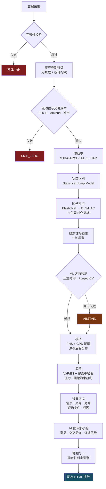

<div align="center">

<br>

<picture>
  <source media="(prefers-color-scheme: dark)" srcset="../webapp/static/plutus_mark.png">
  <source media="(prefers-color-scheme: light)" srcset="../webapp/static/plutus_mark_light.png">
  
</picture>

<br><br>

# PLUTUS

**RESEARCH &nbsp;&amp;&nbsp; ANALYTICS**

<br>

[한국어](../README.md) &nbsp;·&nbsp; [English](README.en.md) &nbsp;·&nbsp; [日本語](README.ja.md) &nbsp;·&nbsp; **简体中文**

<br>

### 机构级量化分析终端

输入一个标的，它会从数据完整性一路走过流动性、波动率、状态识别、因子与风险，<br>
经过 14 位专家小组的审议，产出一份 **零外部资源的自包含 HTML 报告**。

<br>


<br>

`Flask` · `pywebview` · `PyInstaller` · `Cloudflare Workers + D1`<br>
`numpy` · `pandas` · `scipy` · `scikit-learn`

<br>

**Tenko jun · 郑俊和 (Junhwa Jung)**

<br>

</div>

---

<div align="center">

### 关于这个名字

> **Plutus**（Πλοῦτος）— 希腊神话中的财富之神。
> 相传他目盲，因此能 **公平地** 分配财富。
>
> 这个引擎遵循同样的原则：它给出的不是你想看到的结论，
> 而是 **数据允许的结论**。

</div>

---

## 有什么不同

|  |  |
|:--|:--|
| **会弃权的引擎** | 未通过检验的模块不是被扣分，而是 **直接删除其输出。** 样本外准确率 50% 不是弱信号，而是没有信号 |
| **三轴分离判定** | 方向、风险预算、模型置信度 **不合并为一个数。** 把性质不同的信息压成一个数字会摧毁信息 |
| **短 / 中 / 长多期限** | 63 天、252 天、1260 天 **不做平均**，而是把彼此矛盾的地方暴露出来 |
| **按资产类别换镜头** | 黄金和软件不用同一组因子看。资产类别 19 种 × 原型 9 种 |
| **宏观仪表盘** | 每个标的只保留 **对它真正显著的宏观变量**。`\|t\| < 2` 即中性 |
| **当日资金流扫描** | 相对昨日 **同一时刻** 的资金迁移、集中买卖、板块强弱 |
| **自包含报告** | 37 类板块 · 21 种内联 SVG · 4 套主题 · **零外部请求** |
| **66 条术语提示** | 不只是定义，而是 **为什么要看它 + 什么数值算有问题** |
| **无密钥也完整可用** | 没有 API key 也能跑全部功能。密钥只是"有了更好"的补强 |

---

## 30 秒上手

```bash
git clone https://github.com/tenkojun/plutus.git
cd plutus
pip install -r requirements.txt
python run_desktop.py          # → http://127.0.0.1:8765
```

构建 EXE：

```bash
python tools/release.py --build    # → dist/Plutus/ (194MB) + 发布 release
```

开发与测试：

```bash
pip install -r requirements-dev.txt
python -m pytest tests/ -q          # 估计量验证 · 访问控制 · UI · 回归
python tools/check_ui.py            # 内联 JS 语法（11,000 行单文件 HTML）
python tools/check_requirements.py  # 依赖清单是否与代码一致
```

每次推送到 `main` 和每个 PR，CI 都会跑同样的东西。它 **完全不走网络**，
所以行情 API 挂掉时依然是绿的。

---

## 会员等级

| | 免费 | 高级 | 白金 |
|:--|:--:|:--:|:--:|
| 生成报告 | **3 次/日** | 无限 | 无限 |
| 精密分析 · 资金流扫描 | ● | ● | ● |
| 报告主题 · 归档库 · 下载 | — | ● | ● |
| 智能体对话 | — | ● | ● |
| 外部访问（隧道） | — | — | ● |
| 分析队列优先级 | — | — | ● |

额度和功能判定 **全部在服务端** 完成。只在前端拦截的话，直接调用路由就绕过去了。
检查和计数增加放在同一个事务里，所以同时点击也无法突破额度。

注册 **无需审批，立即完成**，新账号从免费等级开始。

---

## 许可证 — MIT

启动画面的音效全部由 Web Audio 实时合成，音频文件为 0 个；启动日志文本和逐行延迟
时序也是本项目自己写的。

界面上用到的 JavaScript 库有 **两个** 属于第三方作品 —— TradingView Lightweight
Charts（Apache-2.0）和 qrcode-generator（MIT）。两者都允许再分发，出处与许可证
见 [THIRD-PARTY.md](../THIRD-PARTY.md)。以前是运行时从 CDN 拉取的，那样一旦 CDN
被污染，任意 JS 就会以本应用的源身份执行；而且没有网络时图表根本出不来。
所以把它们收进了 `webapp/static/vendor/`（合计 182KB）。

**分析报告里没有任何第三方作品。** 图表以字符串形式生成内联 SVG，只用系统字体 ——
因为报告必须能在没有网络时打开，而且几年后打开还要和当时一模一样。

两个许可证都很宽松，可以在不公开源码的前提下单独分发 EXE 并用于商业用途。

---

> ### 一条设计原则
> **精密不是加更多指标，而是不输出错误结果的能力。**

大多数分析工具在毫无依据时也会给出"弱买入 · 55 分"这样的数字。
那不是信息而是噪声，而给噪声打分就是欺骗。

这个引擎会 **让未通过检验的模块输出失效（abstain）。**
样本外准确率 50% 不是弱信号，而是 **没有信号**；
此时正确的输出不是一个被扣分的分数，而是 **根本没有输出。**

```
G4  ML 过拟合 / 校准     失败 → DISABLE_MODULE
    Murphy resolution 0.00000 ≈ 0  → 没有超出基准率的信息
    Brier skill −0.007 ≤ 0         → 还不如常数预测
    过拟合缺口 49.6% > 15%          → 样本内 96.8% vs 样本外 47.2%
    PBO 97.2% ≥ 75%                → 选择过程在结构上就是过拟合的
    策略 DSR 0.0% < 90%             → 多重检验校正后不显著
```

这种情况下，方向概率 **不会被输出。** 不是给个低分，而是根本没有数值。

---

## 流水线



判定不是 LLM 写的。它由每位专家的决策规则推导而来，因此
**相同输入必然得到相同意见 —— 可审计。**

---

## 按标的性格换一副镜头

不能用同一组因子去看黄金和谷歌。每个资产类别的 **因子先验、压力轴、预期 R² 区间、
年化基准、权重上限** 都不一样。

实际运行结果（实测值）：

| 标的 | 资产类别 | 原型 | 选中的因子 | R² | 压力 | 仓位 | 起约束作用的限制 |
|---|---|---|---|---|---|---|---|
| **AAPL** | 大盘个股 | 优质复利成长股 | mkt·smb·hml·umd·vix·hy | 47.9% | −30.2% | 5.0% | 回撤约束凯利 |
| **GLD** | 贵金属 | — | **实际利率 · 美元** | 19.5% | −16.2% | 15.0% | 资产类别上限 |
| **TLT** | 国债 ETF | — | **名义 10 年 · 曲线 · BEI** | **85.3%** | −30.7% | 15.0% | 回撤约束凯利 |
| **PFE** | 大盘个股 | 股息收益股 | mkt·hml·rmw·umd·vix·hy | 22.1% | −26.7% | 15.0% | 资产类别上限 |

R² 区间也按资产类别不同 —— 贵金属 10~55%，国债 55~98%。
用同一个区间套所有资产，国债就永远显示"解释力过剩"，黄金就永远显示"崩塌"。

**资产类别 19 种** · **股票原型 9 种** · **报告板块注册表 37 个**

```
贵金属        实际利率 β 必须时变。黄金-TIPS 的 R² 有过从 2005–2021 年约 84%
              在 2022 年之后崩到个位数的先例（边际买家换人了）。
加密资产      年化用 √365。用 √252 会把波动率低估约 17%。
杠杆 ETP      每日再平衡 → 路径依赖。蒙特卡洛要在标的资产上跑，
              再重建杠杆路径。
国债 ETF      DV01、KRD 必须放进 delta 面板。
```

股票在这里还要再深入一层。**原型** 会改变报告本身的板块构成。

| 原型 | 会被激活的板块 |
|---|---|
| 优质复利成长股 | 基本面 · 财报事件 · 风格 · 特质风险 · 同业 |
| 高增长亏损企业 | 现金跑道 · 摊薄 · 跳跃特征 |
| 股息收益股 | 股息可持续性 · 利率敏感度 · 同业 |
| 事件驱动 | 跳跃与尾部板块置顶，均值统计带警告降级 |

---

## 硬闸门 —— 失败不是扣分，是作废

| 闸门 | 项目 | 阈值 | 失败时的处置 |
|---|---|---|---|
| **G1** | 数据完整性 | 缺失 > 2%、OHLC 违规、重复日期 | `HALT` —— 整体中止 |
| **G2** | 可交易性 | 价差超限、ADV < $1M、无成交日 > 35% | `SIZE_ZERO` |
| **G3** | 因子模型拟合 | R² 低于资产类别区间的 35% | 阻断 alpha 解读 |
| **G4** | ML 过拟合 / 校准 | PBO ≥ 50%、DSR < 90%、过拟合缺口 > 15%、Resolution ≤ 1e-4、Brier skill ≤ 0 | `DISABLE_MODULE` |
| **G7** | 压力上限 | 最坏损失 > 35% | `SIZE_ZERO` |
| **G8** | 归类置信度 | 资产类别判定不确定 | 最小仓位 |

闸门还活着，意味着 **引擎在无法相信自己的输入时会自己停下来。**

---

## 仓位 —— 凯利的问题不在公式，而在假定你知道 μ

```
朴素凯利 μ/σ²          95%
  ↓ 计入估计误差与厚尾
增长最优                 5%   （此时 95% MDD 为 4%）
  ↓ 回撤约束
回撤约束凯利             5%   ← 最终采用
```

增长最优凯利在数学上是对的，却伴随 **无法实际运作的回撤。**
没有回撤约束，任何凯利数值都不能作为实务建议使用。

此外还会计算波动率目标、压力预算、流动性上限、资产类别上限，
并把 **约束力最强的那一条** 作为最终权重。报告里会写明是哪一条起了作用。

---

## 报告

每个标的 **27~31 个板块**、**约 235KB**、**零外部资源** 的自包含 HTML。
所有图表都是内联 SVG —— 没有网络也能打开。

```
I    判定       摘要 · 三轴判定 · 标的性格 · 短/中/长期 · 硬闸门
II   投资论点   驱动情景 · 交易 · 对冲 · 证伪条件 · 收益归因
                宏观仪表盘
III  专家审议   14 位专家 · 交叉质询 · 红队
IV   标的诊断   风格 · 同业 · 流动性 · 业绩 · 波动率 · 状态 · 因子
                delta 面板 · 方向预测 · 分布模拟 · 期权 RND
V    风险       VaR/ES · 压力测试 · 仓位管理
VI   运营与局限 催化剂日历 · 监控计划 · 不能说的事
```

板块注册表有 **37 个**，每个板块自己判断 `applies()`。没有期权的标的就没有 RND 板块，
没有基本面的 ETF 就没有原型板块。**缺的数据不用空白填充，而是把整个板块撤掉。**

**不产出单一分数。** 方向 / 风险预算 / 模型置信度 **分成三个轴**。
把性质不同的信息合成一个数字会摧毁信息。

### 术语提示

把鼠标移到 **66 个** 专业术语上会弹出说明。
不只写定义，还写了 **为什么要看它** 以及 **什么数值算有问题。**

> **DSR** —— 通缩夏普比率
> 对"试了很多策略后挑出最好那个"这一事实做过校正的夏普比率。
> 扔 100 次里的最高纪录不是实力。
> 这个值低于 90%，意味着多重检验校正后并不显著。

### 短期 · 中期 · 长期 —— 不合并

同一个标的，看的期间不同结论也不同。**这本身就是信息。**

| 期限 | 窗口 | 看什么 |
|---|---|---|
| 短期 | 63 个交易日 | 累计收益 · 波动率 · 夏普 · MDD · SMA 斜率 · 跑赢比例 · 均线交叉 |
| 中期 | 252 个交易日 | 同上，外加分期限的市场贝塔 |
| 长期 | 1260 个交易日 | 同上 |

**不构造综合评分。** 把短期 55、中期 72、长期 74 按期限加权压成 67 分（BUY），
"长期结构性上行中的中期回调"这个信息就整个消失了。剩下的只是一个哪个期限都不对应的平均值。

取而代之的是 **找出并展示矛盾之处。**

- 趋势方向在各期限之间是否分歧
- 夏普的 **符号** 是否翻转（只引用其中一个就会得到完全相反的结论）
- 市场贝塔在期限间是否拉开 0.5 以上 → 结构变化信号
- 波动率期限结构 —— 短期/长期之比。比起"正常"这种绝对标签，
  **相对自身长期水平** 的扩张或收缩更准确

漂移 μ̂ 一定和标准误 σ/√T 一起给出。期限越短 SE 越大，μ̂ 越失去意义，
而 **这个事实不被隐藏，会以 t 值标出来。**

### 宏观仪表盘 —— 每个资产类别看不同的变量

不能用同一副镜头看黄金和谷歌。实际利率是黄金价格的核心驱动，对软件公司却只是
贴现率路径；HY 利差对信用敏感资产是决定性的，对黄金则是次要的。

对 **14 种宏观变量**（实际利率、10 年期、曲线斜率、盈亏平衡通胀、美元指数、WTI、
铜/金、HY OAS、VIX、市场超额收益等）做回归，
表里 **只保留该标的回归贝塔真正显著的那些。**

- 影响方向 = `sign(贝塔) × sign(3 个月变化)`
- `|t| < 2` 即 **中性** —— 不拿不显著的贝塔编故事
- 对数收益率变量（美元、WTI、欧元、市场）与水平变量（利率、利差）不混用。
  单位搞错，贡献度会跳到 +75% —— 这是真实踩过并修好的坑

### 市场资金流扫描

"这一节里钱在往哪儿走"被拆成三个问题来回答。

| 标签页 | 回答 |
|---|---|
| **资金迁移** | 相对昨日 **同一时刻**，成交额占比往哪儿转移了（%p） |
| **买入 / 卖出** | 现在在集中买什么、卖什么 |
| **板块强弱** | 今天哪个板块强 |

**美国没有机构/外资/散户的划分。** 不存在公开的实时分主体交易动向 —— 13F 是季度的
且延迟 45 天，按交易时段做主体分解属于付费 tick 数据的领域。所以这里看的是
**行为，而不是主体。**

成交量是合并（consolidated）口径。"免费数据是 IEX 所以只有 2.5%"这个说法只适用于
**实时流** —— 雅虎不用密钥也给合并成交量（实测 AAPL 每日 4,000 万股量级，若只有 IEX
则是 100 万股量级），Alpaca 免费档在 `end` 早于 15 分钟前时也给 SIP bar。

<details>
<summary><b>RVOL 必须拿同一时刻互相比较</b> —— 为什么这是个陷阱</summary>

<br>

把上午 10 点的累计成交量拿去和历史 **整日** 均值比，永远都会得出"成交清淡"。
盘才开没多久，当然如此。

```
RVOL = 今日 09:30~当前的累计成交量
       ────────────────────────────────────────
       过去 20 日 09:30~同一时刻累计量的中位数
```

用中位数而不是均值。这样可以避免一个财报日把均值抬上去，导致之后一个月所有标的
都被判成"安静"。

**合成数据验证** —— 植入真值 3.0 倍，检查能否从部分交易时段中还原：

| 时点 | K 线数 | 估计 RVOL |
|---|---|---|
| 开盘 15 分钟 | 3 / 78 | 2.66 倍 |
| 开盘 50 分钟 | 10 / 78 | 2.85 倍 |
| 半天 | 39 / 78 | 2.92 倍 |
| 全天 | 78 / 78 | 2.99 倍 |

第一版实现在这里给出的是 **0.41 倍**。透视表先 `fill_value=0` 再 `cumsum`，
于是今天这一行的数值一直流到收盘时刻，从那里读"现在"，基准就变成了一整天。
代码自己犯了它本要防的那个错。

</details>

<details>
<summary><b>方向是代理指标</b> —— 光看成交量分不出买还是卖</summary>

<br>

RVOL 和成交额说的是"有多活跃"，不是"在买还是在卖"。这里同时使用两种从 K 线数据
推断方向的标准方法。

- **上涨/下跌成交量** —— 按 K 线收益率的符号切分成交量
- **CMF** —— `((收盘−最低)−(最高−收盘))/(最高−最低)` · 收盘价在 K 线内的位置

两者不一致时不隐藏，标注 **※不一致**。

CMF 只看收盘价在 K 线 **内部** 的位置，所以一只全天阴跌但每根 K 线都从低点抬起来的
标的会被判成净买入。实测中 NVDA 当日 −2.3%，却排在净买入第一（+$1.4B）。
只写"集中买入"会引起误解，所以在该行下面补上
**"下跌中的逢低买入（K 线内为买，日内为跌）"。**

</details>

### 报告主题 · 应用内查看器

报告是零外部资源的自包含 HTML，也就是说 **颜色在生成那一刻就被固化了。**
所以把 CSS 里硬编码的颜色（39 个唯一值 · 出现 108 次）机械地替换成变量，
再在前面注入按主题的调色板 —— 深色 / 浅色 / 棕褐 / 高对比。
深色的取值就是原值，所以默认画面没有变化。

报告在 **应用内的大型弹窗** 中打开（字号调节、下载、新窗口）。
**归档库** 里可以按标的和时间重新打开、下载、删除过去的报告。

---

## 实测验证

引擎内置了验证套件。**它在合成数据里植入真值，检查能否被还原出来。**

```bash
python -m engine.jiqtx.cli --validate
```

| 验证项 | 结果 |
|---|---|
| 价差估计量 | 只有 EDGE 无偏还原（真值 5bp → 5.4bp）。CS、Roll 在低价差下高达 72bp、65bp，严重上偏 |
| GJR-GARCH 参数 | α=0.050 γ=0.060 β=0.880 → 估计 0.067 / 0.087 / 0.844 |
| Murphy resolution | 有信息 0.08001 vs 无信息 0.00019 —— **判别比 411 倍** |
| ACI 保形覆盖率 | 目标 90% → 实测 89.9% / 89.9% / 89.5%（正态 · t(3) · 状态切换） |
| 回撤约束凯利 | SE(μ) 从 2% 增到 25% 时，从 90% 收缩到 60% |
| 原型分类器 | 5/5 通过 |
| PEAD 检验功效 | 注入 +16.0% → 估计 +16.57%，原假设下假阳性率 8%（名义 ≈7%） |

也可以用离线演示跑通整条流水线（不需要网络）。

```bash
python -m engine.jiqtx.cli --demo
```

---

## 运行

```bash
pip install -r requirements.txt
python run_desktop.py
```

打开的是 **应用窗口** 而不是浏览器（`pywebview`）。服务在 `127.0.0.1:8765`。
端口被占用时会找下一个空闲端口；如果已经在运行，就只把窗口打开。

### 构建 EXE

```bash
python tools/release.py --build
```

`dist/Plutus/Plutus.exe` —— **没有控制台窗口，只有应用窗口。**
诊断日志不打到屏幕，而是写到 `.data/logs/app.log`。

同一条命令还会烧出 `dist/Plutus-Setup-x64.exe`（Inno Setup）。它装到
`%LOCALAPPDATA%\Programs\Plutus` 而不是 Program Files —— 因为 Plutus 要写可执行文件
旁边的 `.data\`，而 Program Files 只有管理员能写。`PrivilegesRequired=lowest`
意味着 **完全不会弹 UAC**（在网吧和公司电脑上很重要）。

没有代码签名，所以 SmartScreen 会警告：`更多信息` → `仍要运行`。

---

## API 密钥

**这个仓库里没有密钥。** 没有密钥也能全部运行 ——
雅虎财经 + Stooq 的免密钥回退是默认路径。

密钥在启动应用后从 **设置 → API 密钥** 填入。填了会提升数据质量，
但不填也不会锁掉任何功能。

| 提供方 | 用途 | 免费额度 |
|---|---|---|
| Finnhub | 实时行情、新闻、基本面 | 每分钟 60 次 |
| Alpha Vantage | 技术指标、基本面 | 每分钟 5 次 / 每日 25 次 |
| FMP | 财务报表、SEC 备案 | 每日 250 次 |

填入的密钥只保存在 `.data/keys.json`（权限 0600），且在 `.gitignore` 之列。
如果设置了环境变量（`FINNHUB_API_KEY` 等），环境变量优先。

---

## 账号在云端，数据在本机

登录、注册、等级由 **Cloudflare Workers + D1** 上的中央认证服务器处理，
全部跑在免费额度内。应用内置了默认服务器，装完就能直接登录。

**和我的电脑开不开机无关**，注册照常完成。注册即时生效，从免费等级起步 ——
如果设一个审批队列，第一次来的人什么都没看到就走了。额度由等级来把关，
没有理由把门锁上。

这台电脑上没有账号。取而代之的是 **每个浏览器各自签发一个会话 cookie。**
这个区分之所以重要，是因为外部访问 —— 如果把"在这台电脑上登录的人"直接当作请求方，
那么知道隧道地址的人就全都以所有者身份进来了。

| 问题 | 由谁判断 |
|---|---|
| **你是谁**（账号、密码、状态） | 中央服务器 |
| **这个浏览器登录了吗** | cookie |

安全设计：PBKDF2-SHA256 10 万次（Workers 上限）· 常数时间比较 ·
按 username/IP 的限流（30 分钟 8 次 → 锁定 15 分钟）· 阻断开放重定向 ·
以及时间补偿，使账号是否存在不会从响应时间泄漏。

部署与运维细节见 [`auth-worker/README.md`](../auth-worker/README.md)。

### 外部访问

用 Cloudflare Tunnel 从家外面连进来。有一个看守进程守着隧道。

- 每 20 秒探活，挂了就按指数退避（5 秒 → 最多 5 分钟）重启
- 地址变了立刻向中央服务器重新注册 → **`/go/<账号>` 这个固定地址** 始终指向
  活着的隧道。手机上只需要存这一个地址
- 应用被强制结束后，下次启动会清理掉残留的幽灵进程

---

## 状态全部放在 `.data/` 里

状态若放在程序目录之外，备份、迁移、删除都会只做一半。

```
.data/
├── keys.json               API 密钥 (0600)
├── auth.db                 分析历史 · 社区 · 持仓
├── browser_sessions.json   各浏览器会话 ↔ 中央令牌
├── session.json            本机的中央会话（用于外部访问注册）
├── jiqtx_ledger.db         预测台账（保存 → 打分 → 回流）
├── pc_id · chats/ · cache/ · bin/ · logs/
```

路径只在 [`engine/paths.py`](../engine/paths.py) 一个地方决定。应用目录不可写时会自动
降级到 `%LOCALAPPDATA%`。用 `PLUTUS_DATA_DIR` 可以把它挪到任何地方。
整个 `.data/` 都在 `.gitignore` 里，密钥不会漏进仓库。

---

## 结构

```
.
├── version.py              应用名 · 版本 · 开发者 · 默认认证服务器的唯一来源
├── run_desktop.py          桌面启动器（应用窗口 · 端口自动 · 防重复启动）
├── app.spec                PyInstaller（console=False · 图标 · 版本资源）
├── auth-worker/            中央认证（Workers + D1）
├── webapp/
│   ├── server.py           Flask API —— 125 条路由
│   └── static/index.html   单页应用
└── engine/
    ├── paths.py            运行时路径的唯一决定点
    ├── jiqtx/              ★ 精密分析引擎 —— 33 个模块 / 15,601 行
    │   ├── config          资产类别 19 种 · 因子腿 · 闸门阈值
    │   ├── statcore        PSR/DSR · Purged CV · CPCV/PBO · Murphy · ACI
    │   ├── micro           EDGE · Amihud · 平方根冲击 · capacity
    │   ├── vol regime      GJR-GARCH-t MLE · HAR · Jump Model
    │   ├── simulate        FHS + GPD 尾部 + 漂移后验分布
    │   ├── taxonomy        三段式资产归类（元数据 + 统计指纹）
    │   ├── factors equity  因子路由 · 卡尔曼时变贝塔 · 9 种原型
    │   ├── ml              三重障碍 → 模型竞赛 → 弃权判定
    │   ├── options risk    RND · VaR/ES · 压力 · 回撤约束凯利
    │   ├── thesis trade    情景 · 证伪条件 · 障碍概率 · 最小方差对冲
    │   ├── agents panel    硬闸门 · 14 位专家 · 确定性判定
    │   ├── charts          零外部依赖的内联 SVG 21 种
    │   ├── glossary        66 条术语词典 + 提示引擎
    │   ├── horizons        短/中/长期独立计算 + 分歧检测
    │   ├── macro_board     14 个宏观变量 × 显著贝塔过滤
    │   ├── report_theme    4 套主题调色板注入
    │   ├── dynamic_report  37 个板块注册表 · 自包含 HTML
    │   ├── portfolio       风险贡献 · 因子净额 · 配置竞赛（WF + Hansen MCS）
    │   └── ledger          预测保存 → 打分 → 回流到智能体权重
    ├── data/           多数据源 + market_flow（资金流扫描）
    ├── auth/           会话 · prefs · quota（等级 · 每日额度）
    └── auth_remote/ cloud/ jobs/ portfolio/ awareness/ llm/
```

---

## 局限 —— 请读完再用

这份清单不是谦虚，而是 **使用说明书。**

| 局限 | 含义 |
|---|---|
| **幸存者偏差** | 雅虎财经里没有退市标的。选股策略 **原理上就无法验证。** |
| **日线的局限** | 真正的已实现波动率和订单流需要日内数据。 |
| **基本面不是 PIT** | 是含重述后的数值，禁止用于时间序列回测。**只做当前诊断。** |
| **期权是快照** | 没有历史，无法回测。只能从今天开始积累。 |
| **成交假设** | 应当假设下一交易日开盘价/VWAP，而不是收盘价。**仅这一个选择就能让盈利性反转。** |
| **漂移标准误** | 它是 σ/√T，在日线样本上几乎总是和估计值本身一样大。上涨概率是关于 **假设** 的陈述，不是关于市场的。 |
| **压力测试** | 线性 delta 近似。既不是历史重演值，也不是损失上限。 |

> **胜率不会提高多少。**
> 改进来自去除虚假信号、风险估计，以及仓位纪律。

---

<div align="center">

本软件用于方法论研究与验证，**不构成投资建议。**

**Tenko jun（郑俊和）** · [CHANGELOG](../CHANGELOG.md) · MIT License

</div>
